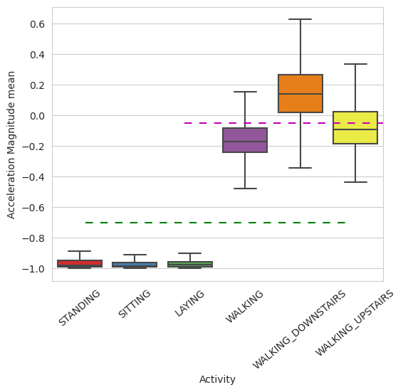
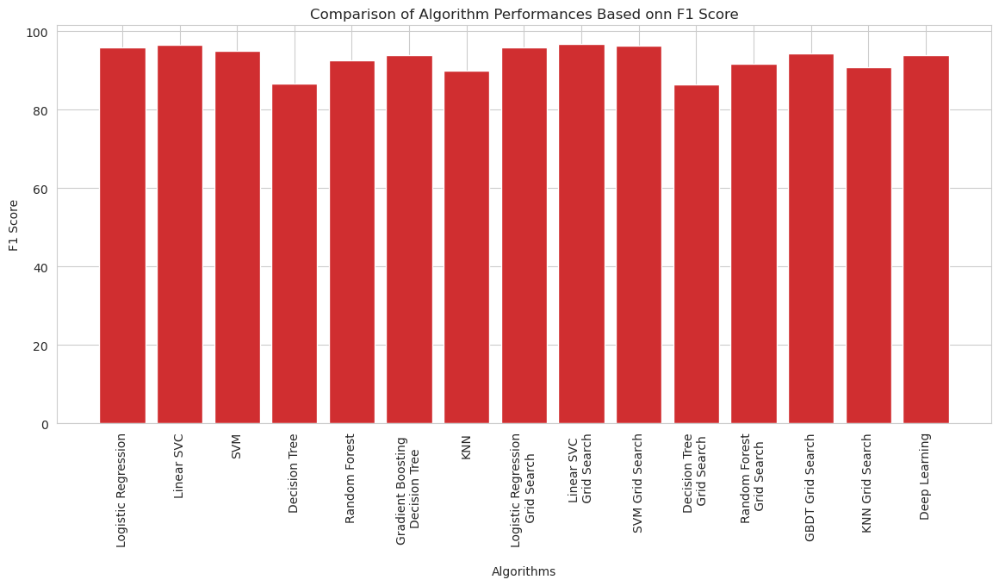

```python

```

# Human Activity Recognition

# Quick overview of the dataset :

* Accelerometer and Gyroscope readings are taken from 30 volunteers(referred as subjects) while performing the following 6 Activities.

    1. Walking     
    2. WalkingUpstairs 
    3. WalkingDownstairs 
    4. Standing 
    5. Sitting 
    6. Lying.


* Readings are divided into a window of 2.56 seconds with 50% overlapping. 

* Accelerometer readings are divided into gravity acceleration and body acceleration readings,
  which has x,y and z components each.

* Gyroscope readings are the measure of angular velocities which has x,y and z components.

* Jerk signals are calculated for BodyAcceleration readings.

* Fourier Transforms are made on the above time readings to obtain frequency readings.

* Now, on all the base signal readings., mean, max, mad, sma, arcoefficient, engerybands,entropy etc., are calculated for each window.

* We get a feature vector of 561 features and these features are given in the dataset.

* Each window of readings is a datapoint of 561 features.

## Problem Framework

* 30 subjects(volunteers) data is randomly split to 70%(21) test and 30%(7) train data.
* Each datapoint corresponds one of the 6 Activities.


## Problem Statement

 + Given a new datapoint we have to predict the Activity


```python
import pandas as pd
import numpy as np
import warnings
warnings.filterwarnings("ignore")
```

## Load dataset


```python
train = pd.read_csv('train.csv')
test = pd.read_csv('test.csv')
```


```python
# print first 2 rows of train data
train.head(2)
```


<div>
<style scoped>
    .dataframe tbody tr th:only-of-type {
        vertical-align: middle;
    }

    .dataframe tbody tr th {
        vertical-align: top;
    }

    .dataframe thead th {
        text-align: right;
    }
</style>
<table border="1" class="dataframe">
  <thead>
    <tr style="text-align: right;">
      <th></th>
      <th>tBodyAcc-mean()-X</th>
      <th>tBodyAcc-mean()-Y</th>
      <th>tBodyAcc-mean()-Z</th>
      <th>tBodyAcc-std()-X</th>
      <th>tBodyAcc-std()-Y</th>
      <th>tBodyAcc-std()-Z</th>
      <th>tBodyAcc-mad()-X</th>
      <th>tBodyAcc-mad()-Y</th>
      <th>tBodyAcc-mad()-Z</th>
      <th>tBodyAcc-max()-X</th>
      <th>...</th>
      <th>fBodyBodyGyroJerkMag-kurtosis()</th>
      <th>angle(tBodyAccMean,gravity)</th>
      <th>angle(tBodyAccJerkMean),gravityMean)</th>
      <th>angle(tBodyGyroMean,gravityMean)</th>
      <th>angle(tBodyGyroJerkMean,gravityMean)</th>
      <th>angle(X,gravityMean)</th>
      <th>angle(Y,gravityMean)</th>
      <th>angle(Z,gravityMean)</th>
      <th>subject</th>
      <th>Activity</th>
    </tr>
  </thead>
  <tbody>
    <tr>
      <th>0</th>
      <td>0.288585</td>
      <td>-0.020294</td>
      <td>-0.132905</td>
      <td>-0.995279</td>
      <td>-0.983111</td>
      <td>-0.913526</td>
      <td>-0.995112</td>
      <td>-0.983185</td>
      <td>-0.923527</td>
      <td>-0.934724</td>
      <td>...</td>
      <td>-0.710304</td>
      <td>-0.112754</td>
      <td>0.030400</td>
      <td>-0.464761</td>
      <td>-0.018446</td>
      <td>-0.841247</td>
      <td>0.179941</td>
      <td>-0.058627</td>
      <td>1</td>
      <td>STANDING</td>
    </tr>
    <tr>
      <th>1</th>
      <td>0.278419</td>
      <td>-0.016411</td>
      <td>-0.123520</td>
      <td>-0.998245</td>
      <td>-0.975300</td>
      <td>-0.960322</td>
      <td>-0.998807</td>
      <td>-0.974914</td>
      <td>-0.957686</td>
      <td>-0.943068</td>
      <td>...</td>
      <td>-0.861499</td>
      <td>0.053477</td>
      <td>-0.007435</td>
      <td>-0.732626</td>
      <td>0.703511</td>
      <td>-0.844788</td>
      <td>0.180289</td>
      <td>-0.054317</td>
      <td>1</td>
      <td>STANDING</td>
    </tr>
  </tbody>
</table>
<p>2 rows × 563 columns</p>
</div>


```python
# print first 2 rows of test data
test.head(2)
```


<div>
<style scoped>
    .dataframe tbody tr th:only-of-type {
        vertical-align: middle;
    }

    .dataframe tbody tr th {
        vertical-align: top;
    }

    .dataframe thead th {
        text-align: right;
    }
</style>
<table border="1" class="dataframe">
  <thead>
    <tr style="text-align: right;">
      <th></th>
      <th>tBodyAcc-mean()-X</th>
      <th>tBodyAcc-mean()-Y</th>
      <th>tBodyAcc-mean()-Z</th>
      <th>tBodyAcc-std()-X</th>
      <th>tBodyAcc-std()-Y</th>
      <th>tBodyAcc-std()-Z</th>
      <th>tBodyAcc-mad()-X</th>
      <th>tBodyAcc-mad()-Y</th>
      <th>tBodyAcc-mad()-Z</th>
      <th>tBodyAcc-max()-X</th>
      <th>...</th>
      <th>fBodyBodyGyroJerkMag-kurtosis()</th>
      <th>angle(tBodyAccMean,gravity)</th>
      <th>angle(tBodyAccJerkMean),gravityMean)</th>
      <th>angle(tBodyGyroMean,gravityMean)</th>
      <th>angle(tBodyGyroJerkMean,gravityMean)</th>
      <th>angle(X,gravityMean)</th>
      <th>angle(Y,gravityMean)</th>
      <th>angle(Z,gravityMean)</th>
      <th>subject</th>
      <th>Activity</th>
    </tr>
  </thead>
  <tbody>
    <tr>
      <th>0</th>
      <td>0.257178</td>
      <td>-0.023285</td>
      <td>-0.014654</td>
      <td>-0.938404</td>
      <td>-0.920091</td>
      <td>-0.667683</td>
      <td>-0.952501</td>
      <td>-0.925249</td>
      <td>-0.674302</td>
      <td>-0.894088</td>
      <td>...</td>
      <td>-0.705974</td>
      <td>0.006462</td>
      <td>0.16292</td>
      <td>-0.825886</td>
      <td>0.271151</td>
      <td>-0.720009</td>
      <td>0.276801</td>
      <td>-0.057978</td>
      <td>2</td>
      <td>STANDING</td>
    </tr>
    <tr>
      <th>1</th>
      <td>0.286027</td>
      <td>-0.013163</td>
      <td>-0.119083</td>
      <td>-0.975415</td>
      <td>-0.967458</td>
      <td>-0.944958</td>
      <td>-0.986799</td>
      <td>-0.968401</td>
      <td>-0.945823</td>
      <td>-0.894088</td>
      <td>...</td>
      <td>-0.594944</td>
      <td>-0.083495</td>
      <td>0.01750</td>
      <td>-0.434375</td>
      <td>0.920593</td>
      <td>-0.698091</td>
      <td>0.281343</td>
      <td>-0.083898</td>
      <td>2</td>
      <td>STANDING</td>
    </tr>
  </tbody>
</table>
<p>2 rows × 563 columns</p>
</div>


```python
print(train.shape)
print(test.shape)
```

    (7352, 563)
    (2947, 563)


# Data Cleaning

### 1. Changing feature names

We always need to special characters from column names.


```python
columns = train.columns

# Removing '()' from column names
columns = columns.str.replace('[()]','')
columns = columns.str.replace('[-]', '')
columns = columns.str.replace('[,]','')

train.columns = columns
test.columns = columns

test.columns
```


    Index(['tBodyAccmeanX', 'tBodyAccmeanY', 'tBodyAccmeanZ', 'tBodyAccstdX',
           'tBodyAccstdY', 'tBodyAccstdZ', 'tBodyAccmadX', 'tBodyAccmadY',
           'tBodyAccmadZ', 'tBodyAccmaxX',
           ...
           'fBodyBodyGyroJerkMagkurtosis', 'angletBodyAccMeangravity',
           'angletBodyAccJerkMeangravityMean', 'angletBodyGyroMeangravityMean',
           'angletBodyGyroJerkMeangravityMean', 'angleXgravityMean',
           'angleYgravityMean', 'angleZgravityMean', 'subject', 'Activity'],
          dtype='object', length=563)


### 2. Check for Duplicates


```python
print('No of duplicates in train: {}'.format(sum(train.duplicated())))
print('No of duplicates in test : {}'.format(sum(test.duplicated())))
```

    No of duplicates in train: 0
    No of duplicates in test : 0


There are no duplicate rows.

### 3. Checking for NaN/null values


```python
print('We have {} NaN/Null values in train'.format(train.isnull().values.sum()))
print('We have {} NaN/Null values in test'.format(test.isnull().values.sum()))
```

    We have 0 NaN/Null values in train
    We have 0 NaN/Null values in test


There are no null values.

### 4. Check for data imbalance

### i) Check number of activites per subject / person.


```python
# import required liabraries for plotting 
import matplotlib.pyplot as plt
import seaborn as sns

sns.set_style('whitegrid')
plt.rcParams['font.family'] = 'Dejavu Sans'
```


```python
plt.figure(figsize=(16,8)) # set fig size
plt.title('Data provided by each user', fontsize=20) # give title
sns.countplot(x='subject',hue='Activity', data = train) # count plot gives count of each activities per subject
plt.show()
```


    

    


### Observations:

1. Each activities are almost same for all volunteers. 

### ii) Check number of data points per class


```python
plt.title('No of Datapoints per Activity', fontsize=15)
sns.countplot(train.Activity) # count plot gives count of each activity
plt.xticks(rotation=90)
plt.show()
```


    

    


### Observation:
All activities is almost balanced.

# Exploratory Data Analysis

### 1. Featuring Engineering from Domain Knowledge 

+ __Static and Dynamic Activities__

    - In static activities (sit, stand, lie down) motion information will not be very useful.
	- In the dynamic activities (Walking, WalkingUpstairs,WalkingDownstairs) motion info will be useful.

### 2. Stationary and Moving activities are completely different


```python
sns.set_palette("Set1", desat=0.80) # Set the matplotlib color cycle using a seaborn palette.
facetgrid = sns.FacetGrid(train, hue='Activity', size=6,aspect=2) # plot smooth histogram
facetgrid.map(sns.distplot,'tBodyAccMagmean', hist=False)\
    .add_legend()
plt.annotate("Stationary Activities", xy=(-0.956,8), xytext=(-0.8, 12), size=20,\
            va='center', ha='left',\
            arrowprops=dict(arrowstyle="simple",connectionstyle="arc3,rad=0.1")) # title

plt.annotate("Moving Activities", xy=(0,3), xytext=(0.2, 9), size=20,\
            va='center', ha='left',\
            arrowprops=dict(arrowstyle="simple",connectionstyle="arc3,rad=0.1")) # title
plt.show()
```


    

    


### Observation:
From above plot we can see that for dynamic activites 'tBodyAccMagmean' features value is more than -0.5. So that we can easily distinguish stationary activities and moving activities.


```python
train['Activity'].value_counts()
```


    LAYING                1407
    STANDING              1374
    SITTING               1286
    WALKING               1226
    WALKING_UPSTAIRS      1073
    WALKING_DOWNSTAIRS     986
    Name: Activity, dtype: int64


```python
# for plotting purposes taking datapoints of each activity to a different dataframe
df1 = train[train['Activity']=='WALKING']
df2 = train[train['Activity']=='WALKING_UPSTAIRS']
df3 = train[train['Activity']=='WALKING_DOWNSTAIRS']
df4 = train[train['Activity']=='SITTING']
df5 = train[train['Activity']=='STANDING']
df6 = train[train['Activity']=='LAYING']
```


```python
plt.figure(figsize=(14,7))
plt.subplot(2,2,1) # plot subplots
plt.title('Stationary Activities')
sns.distplot(df4['tBodyAccMagmean'],color = 'r',hist = False, label = 'Sitting')
sns.distplot(df5['tBodyAccMagmean'],color = 'm',hist = False,label = 'Standing')
sns.distplot(df6['tBodyAccMagmean'],color = 'c',hist = False, label = 'Laying') # plot all stationary activities
plt.axis([-1.1, -0.5, 0, 35])
plt.legend(loc='center')

plt.subplot(2,2,2)
plt.title('Moving Activities')
sns.distplot(df1['tBodyAccMagmean'],color = 'red',hist = False, label = 'Walking')
sns.distplot(df2['tBodyAccMagmean'],color = 'blue',hist = False,label = 'Walking Up')
sns.distplot(df3['tBodyAccMagmean'],color = 'green',hist = False, label = 'Walking down') # plot all moving activities
plt.legend(loc='center right')

plt.tight_layout()
plt.show()
```


    

    


### 3. Magnitude of an acceleration can separate it well


```python
plt.figure(figsize=(6,5))
sns.boxplot(x='Activity', y='tBodyAccMagmean',data=train, showfliers=False, saturation=1)
plt.ylabel('Acceleration Magnitude mean')
plt.axhline(y=-0.7, xmin=0.1, xmax=0.9,dashes=(5,5), c='g')
plt.axhline(y=-0.05, xmin=0.4, dashes=(5,5), c='m')
plt.xticks(rotation=40)
plt.show()
```


    

    


### Observations:
- If tAccMean is < -0.8 then the Activities are either Standing or Sitting or Laying.
- If tAccMean is > -0.6 then the Activities are either Walking or WalkingDownstairs or WalkingUpstairs.
- If tAccMean > 0.0 then the Activity is WalkingDownstairs.
- We can classify 75% the Acitivity labels with some errors.

### 4. Position of GravityAccelerationComponants also matters


```python
sns.boxplot(x='Activity', y='angleXgravityMean', data=train)
plt.axhline(y=0.08, xmin=0.1, xmax=0.9,c='m',dashes=(5,3))
plt.title('Angle between X-axis and Gravity_mean', fontsize=15)
plt.xticks(rotation = 40)
plt.show()
```


    

    


### Observations:
* If angleX,gravityMean > 0 then Activity is Laying.
* We can classify all datapoints belonging to Laying activity with just a single if else statement.

# Dimensionality Reduction

- We have total 564 features, we could not able to analyze all the features through EDA. 

- By applying dimensionality reduction technique we can analyze all the features.

- Let's see can we able to differentiate activities after applying dimensionality reduction technique.

## Apply T-SNE on the data

- T - SNE is used for dimensionality reduction. Here we are converting 564 dimensions into 2 dimensions. So that we can easily analyze the data.


```python
from sklearn.manifold import TSNE
```


```python
# performs t-sne with different perplexity values and their repective plots..
# https://scikit-learn.org/stable/modules/generated/sklearn.manifold.TSNE.html

def perform_tsne(X_data, y_data, perplexities, n_iter=1000, img_name_prefix='t-sne'):
        
    for index,perplexity in enumerate(perplexities):
        # perform t-sne
        print('\nperforming tsne with perplexity {} and with {} iterations at max'.format(perplexity, n_iter))
        X_reduced = TSNE(verbose=2, perplexity=perplexity).fit_transform(X_data)
        print('Done..')
        
        # prepare the data for seaborn         
        print('Creating plot for this t-sne visualization..')
        df = pd.DataFrame({'x':X_reduced[:,0], 'y':X_reduced[:,1] ,'label':y_data})
        
        # draw the plot in appropriate place in the grid
        sns.lmplot(data=df, x='x', y='y', hue='label', fit_reg=False, size=8,\
                   palette="Set1",markers=['^','v','s','o', '1','2'])
        plt.title("perplexity : {} and max_iter : {}".format(perplexity, n_iter))
        plt.show()
        print('Done')

```

- We have added subject column for EDA only, it will not be useful for tsne, drop it.
- we are applying tsne on activity. Use activity as a y label. 


```python
X_pre_tsne = train.drop(['subject','Activity'], axis=1)
y_pre_tsne = train['Activity']
perform_tsne(X_data = X_pre_tsne,y_data=y_pre_tsne, perplexities =[2,5,10])
```

    
    performing tsne with perplexity 2 and with 1000 iterations at max
    [t-SNE] Computing 7 nearest neighbors...
    [t-SNE] Indexed 7352 samples in 0.000s...
    [t-SNE] Computed neighbors for 7352 samples in 2.461s...
    [t-SNE] Computed conditional probabilities for sample 1000 / 7352
    [t-SNE] Computed conditional probabilities for sample 2000 / 7352
    [t-SNE] Computed conditional probabilities for sample 3000 / 7352
    [t-SNE] Computed conditional probabilities for sample 4000 / 7352
    [t-SNE] Computed conditional probabilities for sample 5000 / 7352
    [t-SNE] Computed conditional probabilities for sample 6000 / 7352
    [t-SNE] Computed conditional probabilities for sample 7000 / 7352
    [t-SNE] Computed conditional probabilities for sample 7352 / 7352
    [t-SNE] Mean sigma: 0.597464
    [t-SNE] Computed conditional probabilities in 0.032s
    [t-SNE] Iteration 50: error = 124.7280731, gradient norm = 0.0261871 (50 iterations in 6.561s)
    [t-SNE] Iteration 100: error = 106.7188187, gradient norm = 0.0293617 (50 iterations in 3.075s)
    [t-SNE] Iteration 150: error = 100.6477966, gradient norm = 0.0205695 (50 iterations in 2.604s)
    [t-SNE] Iteration 200: error = 97.3168106, gradient norm = 0.0169849 (50 iterations in 2.622s)
    [t-SNE] Iteration 250: error = 95.0482254, gradient norm = 0.0163377 (50 iterations in 2.558s)
    [t-SNE] KL divergence after 250 iterations with early exaggeration: 95.048225
    [t-SNE] Iteration 300: error = 4.1151938, gradient norm = 0.0015632 (50 iterations in 2.448s)
    [t-SNE] Iteration 350: error = 3.2056985, gradient norm = 0.0010149 (50 iterations in 2.381s)
    [t-SNE] Iteration 400: error = 2.7770786, gradient norm = 0.0007153 (50 iterations in 2.341s)
    [t-SNE] Iteration 450: error = 2.5123303, gradient norm = 0.0005753 (50 iterations in 2.470s)
    [t-SNE] Iteration 500: error = 2.3290408, gradient norm = 0.0004766 (50 iterations in 2.441s)
    [t-SNE] Iteration 550: error = 2.1906416, gradient norm = 0.0004190 (50 iterations in 2.495s)
    [t-SNE] Iteration 600: error = 2.0810955, gradient norm = 0.0003706 (50 iterations in 2.417s)
    [t-SNE] Iteration 650: error = 1.9910088, gradient norm = 0.0003344 (50 iterations in 2.337s)
    [t-SNE] Iteration 700: error = 1.9152800, gradient norm = 0.0003025 (50 iterations in 2.118s)
    [t-SNE] Iteration 750: error = 1.8502806, gradient norm = 0.0002765 (50 iterations in 2.353s)
    [t-SNE] Iteration 800: error = 1.7934812, gradient norm = 0.0002548 (50 iterations in 1.704s)
    [t-SNE] Iteration 850: error = 1.7433038, gradient norm = 0.0002375 (50 iterations in 1.513s)
    [t-SNE] Iteration 900: error = 1.6986004, gradient norm = 0.0002268 (50 iterations in 1.508s)
    [t-SNE] Iteration 950: error = 1.6583810, gradient norm = 0.0002127 (50 iterations in 1.365s)
    [t-SNE] Iteration 1000: error = 1.6219831, gradient norm = 0.0002002 (50 iterations in 1.349s)
    [t-SNE] KL divergence after 1000 iterations: 1.621983
    Done..
    Creating plot for this t-sne visualization..


    

    


    Done
    
    performing tsne with perplexity 5 and with 1000 iterations at max
    [t-SNE] Computing 16 nearest neighbors...
    [t-SNE] Indexed 7352 samples in 0.016s...
    [t-SNE] Computed neighbors for 7352 samples in 1.648s...
    [t-SNE] Computed conditional probabilities for sample 1000 / 7352
    [t-SNE] Computed conditional probabilities for sample 2000 / 7352
    [t-SNE] Computed conditional probabilities for sample 3000 / 7352
    [t-SNE] Computed conditional probabilities for sample 4000 / 7352
    [t-SNE] Computed conditional probabilities for sample 5000 / 7352
    [t-SNE] Computed conditional probabilities for sample 6000 / 7352
    [t-SNE] Computed conditional probabilities for sample 7000 / 7352
    [t-SNE] Computed conditional probabilities for sample 7352 / 7352
    [t-SNE] Mean sigma: 0.961446
    [t-SNE] Computed conditional probabilities in 0.031s
    [t-SNE] Iteration 50: error = 114.0895081, gradient norm = 0.0249417 (50 iterations in 1.757s)
    [t-SNE] Iteration 100: error = 97.1406784, gradient norm = 0.0159803 (50 iterations in 1.318s)
    [t-SNE] Iteration 150: error = 92.9368744, gradient norm = 0.0079482 (50 iterations in 1.459s)
    [t-SNE] Iteration 200: error = 90.9939499, gradient norm = 0.0067086 (50 iterations in 1.522s)
    [t-SNE] Iteration 250: error = 89.8516235, gradient norm = 0.0065688 (50 iterations in 1.506s)
    [t-SNE] KL divergence after 250 iterations with early exaggeration: 89.851624
    [t-SNE] Iteration 300: error = 3.5661004, gradient norm = 0.0014577 (50 iterations in 1.474s)
    [t-SNE] Iteration 350: error = 2.8093054, gradient norm = 0.0007452 (50 iterations in 1.365s)
    [t-SNE] Iteration 400: error = 2.4291677, gradient norm = 0.0005250 (50 iterations in 1.208s)
    [t-SNE] Iteration 450: error = 2.2124760, gradient norm = 0.0004077 (50 iterations in 1.239s)
    [t-SNE] Iteration 500: error = 2.0680718, gradient norm = 0.0003312 (50 iterations in 1.192s)
    [t-SNE] Iteration 550: error = 1.9631777, gradient norm = 0.0002856 (50 iterations in 1.271s)
    [t-SNE] Iteration 600: error = 1.8822181, gradient norm = 0.0002473 (50 iterations in 1.255s)
    [t-SNE] Iteration 650: error = 1.8173095, gradient norm = 0.0002174 (50 iterations in 1.254s)
    [t-SNE] Iteration 700: error = 1.7636366, gradient norm = 0.0001988 (50 iterations in 1.255s)
    [t-SNE] Iteration 750: error = 1.7183864, gradient norm = 0.0001788 (50 iterations in 1.443s)
    [t-SNE] Iteration 800: error = 1.6793814, gradient norm = 0.0001643 (50 iterations in 1.553s)
    [t-SNE] Iteration 850: error = 1.6456933, gradient norm = 0.0001515 (50 iterations in 1.490s)
    [t-SNE] Iteration 900: error = 1.6158504, gradient norm = 0.0001419 (50 iterations in 1.521s)
    [t-SNE] Iteration 950: error = 1.5895380, gradient norm = 0.0001339 (50 iterations in 1.443s)
    [t-SNE] Iteration 1000: error = 1.5658569, gradient norm = 0.0001273 (50 iterations in 1.318s)
    [t-SNE] KL divergence after 1000 iterations: 1.565857
    Done..
    Creating plot for this t-sne visualization..


    

    


    Done
    
    performing tsne with perplexity 10 and with 1000 iterations at max
    [t-SNE] Computing 31 nearest neighbors...
    [t-SNE] Indexed 7352 samples in 0.013s...
    [t-SNE] Computed neighbors for 7352 samples in 1.334s...
    [t-SNE] Computed conditional probabilities for sample 1000 / 7352
    [t-SNE] Computed conditional probabilities for sample 2000 / 7352
    [t-SNE] Computed conditional probabilities for sample 3000 / 7352
    [t-SNE] Computed conditional probabilities for sample 4000 / 7352
    [t-SNE] Computed conditional probabilities for sample 5000 / 7352
    [t-SNE] Computed conditional probabilities for sample 6000 / 7352
    [t-SNE] Computed conditional probabilities for sample 7000 / 7352
    [t-SNE] Computed conditional probabilities for sample 7352 / 7352
    [t-SNE] Mean sigma: 1.133827
    [t-SNE] Computed conditional probabilities in 0.056s
    [t-SNE] Iteration 50: error = 105.9288254, gradient norm = 0.0189919 (50 iterations in 1.842s)
    [t-SNE] Iteration 100: error = 90.5059586, gradient norm = 0.0105301 (50 iterations in 1.318s)
    [t-SNE] Iteration 150: error = 87.3414001, gradient norm = 0.0056171 (50 iterations in 1.286s)
    [t-SNE] Iteration 200: error = 86.0553665, gradient norm = 0.0042236 (50 iterations in 1.286s)
    [t-SNE] Iteration 250: error = 85.3435669, gradient norm = 0.0040753 (50 iterations in 1.569s)
    [t-SNE] KL divergence after 250 iterations with early exaggeration: 85.343567
    [t-SNE] Iteration 300: error = 3.1291499, gradient norm = 0.0013797 (50 iterations in 1.522s)
    [t-SNE] Iteration 350: error = 2.4869437, gradient norm = 0.0006510 (50 iterations in 1.506s)
    [t-SNE] Iteration 400: error = 2.1685479, gradient norm = 0.0004233 (50 iterations in 1.430s)
    [t-SNE] Iteration 450: error = 1.9848157, gradient norm = 0.0003144 (50 iterations in 1.443s)
    [t-SNE] Iteration 500: error = 1.8663387, gradient norm = 0.0002541 (50 iterations in 1.239s)
    [t-SNE] Iteration 550: error = 1.7828276, gradient norm = 0.0002106 (50 iterations in 1.270s)
    [t-SNE] Iteration 600: error = 1.7200665, gradient norm = 0.0001812 (50 iterations in 1.324s)
    [t-SNE] Iteration 650: error = 1.6710463, gradient norm = 0.0001585 (50 iterations in 1.249s)
    [t-SNE] Iteration 700: error = 1.6313419, gradient norm = 0.0001416 (50 iterations in 1.256s)
    [t-SNE] Iteration 750: error = 1.5984290, gradient norm = 0.0001301 (50 iterations in 1.254s)
    [t-SNE] Iteration 800: error = 1.5708342, gradient norm = 0.0001178 (50 iterations in 1.474s)
    [t-SNE] Iteration 850: error = 1.5472555, gradient norm = 0.0001104 (50 iterations in 1.599s)
    [t-SNE] Iteration 900: error = 1.5270832, gradient norm = 0.0001016 (50 iterations in 1.537s)
    [t-SNE] Iteration 950: error = 1.5095947, gradient norm = 0.0000990 (50 iterations in 1.584s)
    [t-SNE] Iteration 1000: error = 1.4945085, gradient norm = 0.0000921 (50 iterations in 1.507s)
    [t-SNE] KL divergence after 1000 iterations: 1.494509
    Done..
    Creating plot for this t-sne visualization..


    

    


    Done


### Observations:
- From above plot we can clearly distinguish all the activities, excluding standing and sitting. These two activities are overlapping with each other.
- After building a model may be it will be difficult for model to distinguish these 2 classes.
- Le't check...

# Make data model ready


```python
# get X_test and y_test from train csv file
X_train = train.drop(['subject', 'Activity'], axis=1)
y_train = train.Activity
```


```python
# get X_test and y_test from test csv file
X_test = test.drop(['subject', 'Activity'], axis=1)
y_test = test.Activity
```


```python
print('X_train and y_train : ({},{})'.format(X_train.shape, y_train.shape))
print('X_test  and y_test  : ({},{})'.format(X_test.shape, y_test.shape))
```

    X_train and y_train : ((7352, 561),(7352,))
    X_test  and y_test  : ((2947, 561),(2947,))


# Model Building

### Creating a function to run any specified model


```python
# This function will return accuracy, normalized confusion matrix, precision, recall, and f1-score.
from datetime import datetime
from sklearn.model_selection import cross_val_score
from sklearn.model_selection import KFold
def perform_model(model, X_train, y_train, X_test, y_test, class_labels, cm_normalize=True, \
                 print_cm=True, cm_cmap=plt.cm.Greens):
    
    
    # to store results at various phases
    results = dict()
    
    # time at which model starts training 
    train_start_time = datetime.now()
    print('training the model..')
    model.fit(X_train, y_train)
    print('Done \n \n')
    train_end_time = datetime.now()
    results['training_time'] =  train_end_time - train_start_time
    print('training_time(HH:MM:SS.ms) - {}\n\n'.format(results['training_time']))
    
    
    # predict test data
    print('Predicting test data')
    test_start_time = datetime.now()
    y_pred = model.predict(X_test)
    test_end_time = datetime.now()
    print('Done \n \n')
    results['testing_time'] = test_end_time - test_start_time
    print('testing time(HH:MM:SS:ms) - {}\n\n'.format(results['testing_time']))
    results['predicted'] = y_pred
   

    # calculate overall accuracty of the model
    accuracy = metrics.accuracy_score(y_true=y_test, y_pred=y_pred)
    # store accuracy in results
    results['accuracy'] = accuracy
    print('----------------------')
    print('|      Accuracy      |')
    print('----------------------')
    print('\n    {}\n\n'.format(accuracy))
    
    # calculate overall precision of the model
    precision = metrics.precision_score(y_true=y_test, y_pred=y_pred, average="weighted")
    # store precision in results
    results['precision'] = precision
    print('-----------------------')
    print('|      Precision      |')
    print('-----------------------')
    print('\n    {}\n\n'.format(precision))
    
    # calculate overall recall of the model
    recall = metrics.recall_score(y_true=y_test, y_pred=y_pred, average="weighted")
    # store recall in results
    results['recall'] = recall
    print('--------------------')
    print('|      Recall      |')
    print('--------------------')
    print('\n    {}\n\n'.format(recall))
    
    
    # calculate overall F1 score of the model
    f1 = metrics.f1_score(y_true=y_test, y_pred=y_pred, average="weighted")
    # store F1 score in results
    results['f1'] = f1
    print('----------------------')
    print('|      F1 Score      |')
    print('----------------------')
    print('\n    {}\n\n'.format(f1))
    
    
    
    
    # confusion matrix
    cm = metrics.confusion_matrix(y_test, y_pred)
    results['confusion_matrix'] = cm
    if print_cm: 
        print('--------------------')
        print('| Confusion Matrix |')
        print('--------------------')
        print('\n {}\n\n'.format(cm))
    
    # sensitivity and specificity
    def calc_sensitivity(confusion_matrix):
        """Calculate sensitivity (true positive rate) from a confusion matrix."""
        tp = confusion_matrix[1, 1]
        fn = confusion_matrix[1, 0]
        sensitivity = tp / (tp + fn)
        return sensitivity

    def calc_specificity(confusion_matrix):
        """Calculate specificity (true negative rate) from a confusion matrix."""
        tn = confusion_matrix[0, 0]
        fp = confusion_matrix[0, 1]
        specificity = tn / (tn + fp)
        return specificity
    
    sensitivity = calc_sensitivity(cm)
    specificity = calc_specificity(cm)
    
    # store sensitivity and specificity in results
    results['sensitivity']=sensitivity
    results['specificity']=specificity
    
    print('---------------')
    print('| Sensitivity |')
    print('---------------')
    print('\n {}\n\n'.format(sensitivity))
    
    print('---------------')
    print('| Specificity |')
    print('---------------')
    print('\n {}\n\n'.format(specificity))
    
    # true positives, true negatives, false positives and false negatives
    def tp_tn_fp_fn(confusion_matrix):
        TN = cm[1][0]
        FN = cm[0][0]
        TP = cm[1][1]
        FP = cm[0][1]
        print('--------------------------------------------------------------------')
        print('| True Positive, True Negative, False Positive and False Negatives |')
        print('--------------------------------------------------------------------\n')
        
        # store TP,NP,FP,TN in results
        results['TP']=TP
        results['TN']=TN
        results['FP']=FP
        results['FN']=FN
        
        
        print("True Positive :",TP)
        print("True Negative :",TN)
        print("False Positive :",FP)
        print("False Negative :",FN)
        
        # Print rates of true positives, true negatives, false positives and false negatives
   
        TPR = TP/(TP+FN)
        TNR = TN/(TN+FP)
        FPR = FP/(FP+TN)
        FNR = FN/(TP+FN)
        
        # store rates in results
        results['TPR']=TPR
        results['TNR']=TNR
        results['FPR']=FPR
        results['FNR']=FNR
        
        print('\n\n---------------------------------------------------------------------------')
        print('| Rate of True Positive, True Negative, False Positive and False Negative |')
        print('---------------------------------------------------------------------------\n')
        print("True Positive Rate :",TPR)
        print("True Negative Rate :",TNR)
        print("False Positive Rate :",FPR)
        print("False Negative Rate :",FNR)
        

        # Print predictive value of positive and negative predictions
        PPV = TP/(TP+FP)
        NPV = TN/(TN+FN)
        
        # store PPV and NPV in results
        results['PPV']=PPV
        results['NPV']=NPV
        
        print('\n\n---------------------------------------------------------')
        print('| Predictive Value of Positive and Negative Predictions |')
        print('---------------------------------------------------------\n')
        print("Positive Predictive Value :",PPV)
        print("Negative predictive value :",NPV)
        
    tp_tn_fp_fn(cm)
    
        
    # plot confusin matrix
    plt.figure(figsize=(8,8))
    plt.grid(b=False)
    plot_confusion_matrix(cm, classes=class_labels, normalize=True, title='Normalized confusion matrix', cmap = cm_cmap)
    plt.show()
    
    # get classification report
    print('\n\n------------------------')
    print('| Classifiction Report |')
    print('------------------------')
    classification_report = metrics.classification_report(y_test, y_pred)
    # store report in results
    results['classification_report'] = classification_report
    print(classification_report)
    


    # Define function to print model attributes and cross-validation results
    def print_attributes(model):

        test_encoded = pd.get_dummies(test)

        # Ensure that test set has same features as training set
        missing_cols = set(X_train.columns) - set(test_encoded.columns)
        for col in missing_cols:
            test_encoded[col] = 0
        test_encoded = test_encoded[X_train.columns]

        # Set up cross-validation using 5 folds
        kf = KFold(n_splits=5, shuffle=True, random_state=42)

        # Initialize list to store cross-validation scores
        scores = []

        # Perform cross-validation
        for train_index, val_index in kf.split(X_train):
            # Split training data into training and validation sets
            X_train_fold, X_val_fold = X_train.iloc[train_index], X_train.iloc[val_index]
            y_train_fold, y_val_fold = y_train.iloc[train_index], y_train.iloc[val_index]

            # Fit Logistic Regression model on training data
            model.fit(X_train_fold, y_train_fold)

            # Evaluate model performance on validation data
            score = model.score(X_val_fold, y_val_fold)
            scores.append(score)

        # Compute mean cross-validation score
        mean_score = sum(scores) / len(scores)

        # Fit Logistic Regression model on entire training data and make predictions on test data
        model.fit(X_train, y_train)

        y_pred = model.predict(test_encoded)


        # store test set predictions in results
        test_set_predictions = y_pred
        results['test_set_predictions'] = test_set_predictions


        print('\n\n---------------------------')
        print('|   Test set predictions  |')
        print('---------------------------\n')
        print(f"{test_set_predictions}")

        # store test set predictions in results
        cross_validation_scores=scores
        results['cross_validation_scores'] = cross_validation_scores

        print('\n\n-------------------------------')
        print('|   Cross-Validation Results  |')
        print('-------------------------------')
        print(f"\n{cross_validation_scores}")

        # store mean accuracy of cross validation scores in results

        mean_accuracy=mean_score
        results['mean_accuracy'] = mean_accuracy

        print('\n\n--------------------')
        print('|   Mean Accuracy  |')
        print('--------------------')
        print(f"\n{mean_accuracy:.2f}")

        # store standard deviation of scores in results    
        standard_deviation=np.std(scores)
        results['standard_deviation'] = standard_deviation

        print('\n\n-------------------------')
        print('|   Standard Deviation  |')
        print('-------------------------')
        print(f"\n{standard_deviation:.4f}")

        # store cross validation accuracy in results    
        cross_val_accuracy=mean_score*100
        results['cross_val_accuracy'] = cross_val_accuracy

        print('\n\n---------------')
        print('|   Accuracy  |')
        print('---------------')
        print(f"\n{cross_val_accuracy}")
    print_attributes(model)

    
    # add the trained  model to the results
    results['model'] = model
    
    return results
    
```


```python

```

### Function to print the gridsearch Attributes


```python
# This fuction returns best parameters after applying gridsearch
def print_grid_search_attributes(model):
    # Estimator that gave highest score among all the estimators formed in GridSearch
    print('--------------------------')
    print('|      Best Estimator     |')
    print('--------------------------')
    print('\n\t{}\n'.format(model.best_estimator_))


    # parameters that gave best results while performing grid search
    print('--------------------------')
    print('|     Best parameters     |')
    print('--------------------------')
    print('\tParameters of best estimator : \n\n\t{}\n'.format(model.best_params_))


    #  number of cross validation splits
    print('---------------------------------')
    print('|   No of CrossValidation sets   |')
    print('--------------------------------')
    print('\n\tTotal numbre of cross validation sets: {}\n'.format(model.n_splits_))


    # Average cross validated score of the best estimator, from the Grid Search 
    print('--------------------------')
    print('|        Best Score       |')
    print('--------------------------')
    print('\n\tAverage Cross Validate scores of best estimator : \n\n\t{}\n'.format(model.best_score_))

```

### Function to plot the confusion matrix


```python
# Labels that are useful in plotting confusion matrix
labels=['LAYING', 'SITTING','STANDING','WALKING','WALKING_DOWNSTAIRS','WALKING_UPSTAIRS']
```


```python
import itertools
from sklearn.metrics import confusion_matrix

# This fuction print confusion matrix
def plot_confusion_matrix(cm, classes,
                          normalize=False,
                          title='Confusion matrix',
                          cmap=plt.cm.Blues):
    if normalize:
        cm = cm.astype('float') / cm.sum(axis=1)[:, np.newaxis]

    plt.imshow(cm, interpolation='nearest', cmap=cmap)
    plt.title(title)
    plt.colorbar()
    tick_marks = np.arange(len(classes))
    plt.xticks(tick_marks, classes, rotation=90)
    plt.yticks(tick_marks, classes)

    fmt = '.2f' if normalize else 'd'
    thresh = cm.max() / 2.
    for i, j in itertools.product(range(cm.shape[0]), range(cm.shape[1])):
        plt.text(j, i, format(cm[i, j], fmt),
                 horizontalalignment="center",
                 color="white" if cm[i, j] > thresh else "black")

    plt.tight_layout()
    plt.ylabel('True label')
    plt.xlabel('Predicted label')
```

## 1. Logistic Regression


```python
from sklearn import linear_model
from sklearn import metrics

log_reg = linear_model.LogisticRegression()
log_reg_results =  perform_model(log_reg, X_train, y_train, X_test, y_test, class_labels=labels)
```

    training the model..
    Done 
     
    
    training_time(HH:MM:SS.ms) - 0:00:01.082446
    
    
    Predicting test data
    Done 
     
    
    testing time(HH:MM:SS:ms) - 0:00:00.015593
    
    
    ----------------------
    |      Accuracy      |
    ----------------------
    
        0.9589412962334578
    
    
    -----------------------
    |      Precision      |
    -----------------------
    
        0.9601251785829318
    
    
    --------------------
    |      Recall      |
    --------------------
    
        0.9589412962334578
    
    
    ----------------------
    |      F1 Score      |
    ----------------------
    
        0.958803319361348
    
    
    --------------------
    | Confusion Matrix |
    --------------------
    
     [[537   0   0   0   0   0]
     [  0 430  58   0   0   3]
     [  0  16 516   0   0   0]
     [  0   0   0 492   3   1]
     [  0   0   0   4 405  11]
     [  0   0   0  24   1 446]]
    
    
    ---------------
    | Sensitivity |
    ---------------
    
     1.0
    
    
    ---------------
    | Specificity |
    ---------------
    
     1.0
    
    
    --------------------------------------------------------------------
    | True Positive, True Negative, False Positive and False Negatives |
    --------------------------------------------------------------------
    
    True Positive : 430
    True Negative : 0
    False Positive : 0
    False Negative : 537
    
    
    ---------------------------------------------------------------------------
    | Rate of True Positive, True Negative, False Positive and False Negative |
    ---------------------------------------------------------------------------
    
    True Positive Rate : 0.4446742502585315
    True Negative Rate : nan
    False Positive Rate : nan
    False Negative Rate : 0.5553257497414684
    
    
    ---------------------------------------------------------
    | Predictive Value of Positive and Negative Predictions |
    ---------------------------------------------------------
    
    Positive Predictive Value : 1.0
    Negative predictive value : 0.0


    

    


    
    
    ------------------------
    | Classifiction Report |
    ------------------------
                        precision    recall  f1-score   support
    
                LAYING       1.00      1.00      1.00       537
               SITTING       0.96      0.88      0.92       491
              STANDING       0.90      0.97      0.93       532
               WALKING       0.95      0.99      0.97       496
    WALKING_DOWNSTAIRS       0.99      0.96      0.98       420
      WALKING_UPSTAIRS       0.97      0.95      0.96       471
    
              accuracy                           0.96      2947
             macro avg       0.96      0.96      0.96      2947
          weighted avg       0.96      0.96      0.96      2947
    
    
    
    ---------------------------
    |   Test set predictions  |
    ---------------------------
    
    ['STANDING' 'STANDING' 'STANDING' ... 'WALKING_UPSTAIRS'
     'WALKING_UPSTAIRS' 'WALKING_UPSTAIRS']
    
    
    -------------------------------
    |   Cross-Validation Results  |
    -------------------------------
    
    [0.9796057104010877, 0.9775662814411965, 0.9836734693877551, 0.9877551020408163, 0.9843537414965986]
    
    
    --------------------
    |   Mean Accuracy  |
    --------------------
    
    0.98
    
    
    -------------------------
    |   Standard Deviation  |
    -------------------------
    
    0.0036
    
    
    ---------------
    |   Accuracy  |
    ---------------
    
    98.25908609534908


```python
# plot confusion matrix
plt.figure(figsize=(8,8))
plt.grid(b=False)
plot_confusion_matrix(log_reg_results['confusion_matrix'], classes=labels, cmap=plt.cm.Greens, )
plt.show()
```


    

    


### Observations:
- We got 98.25% test accuracy.
- From confusion matrix we can clearly see that, there are more wrong predictions between standing and sitting classes. By observing tsne plot we have observed that these two classes are overlapped.

## 2. Linear SVC


```python
from sklearn.svm import LinearSVC

lr_svc = LinearSVC(tol=0.00005,max_iter=2000)
lr_svc_results = perform_model(lr_svc, X_train, y_train, X_test, y_test, class_labels=labels)
```

    training the model..
    Done 
     
    
    training_time(HH:MM:SS.ms) - 0:00:05.929397
    
    
    Predicting test data
    Done 
     
    
    testing time(HH:MM:SS:ms) - 0:00:00.015635
    
    
    ----------------------
    |      Accuracy      |
    ----------------------
    
        0.9650492025788938
    
    
    -----------------------
    |      Precision      |
    -----------------------
    
        0.9666478744965822
    
    
    --------------------
    |      Recall      |
    --------------------
    
        0.9650492025788938
    
    
    ----------------------
    |      F1 Score      |
    ----------------------
    
        0.964804947801783
    
    
    --------------------
    | Confusion Matrix |
    --------------------
    
     [[537   0   0   0   0   0]
     [  2 423  62   0   0   4]
     [  0  10 521   1   0   0]
     [  0   0   0 496   0   0]
     [  0   0   0   2 413   5]
     [  0   0   0  17   0 454]]
    
    
    ---------------
    | Sensitivity |
    ---------------
    
     0.9952941176470588
    
    
    ---------------
    | Specificity |
    ---------------
    
     1.0
    
    
    --------------------------------------------------------------------
    | True Positive, True Negative, False Positive and False Negatives |
    --------------------------------------------------------------------
    
    True Positive : 423
    True Negative : 2
    False Positive : 0
    False Negative : 537
    
    
    ---------------------------------------------------------------------------
    | Rate of True Positive, True Negative, False Positive and False Negative |
    ---------------------------------------------------------------------------
    
    True Positive Rate : 0.440625
    True Negative Rate : 1.0
    False Positive Rate : 0.0
    False Negative Rate : 0.559375
    
    
    ---------------------------------------------------------
    | Predictive Value of Positive and Negative Predictions |
    ---------------------------------------------------------
    
    Positive Predictive Value : 1.0
    Negative predictive value : 0.0037105751391465678


    

    


    
    
    ------------------------
    | Classifiction Report |
    ------------------------
                        precision    recall  f1-score   support
    
                LAYING       1.00      1.00      1.00       537
               SITTING       0.98      0.86      0.92       491
              STANDING       0.89      0.98      0.93       532
               WALKING       0.96      1.00      0.98       496
    WALKING_DOWNSTAIRS       1.00      0.98      0.99       420
      WALKING_UPSTAIRS       0.98      0.96      0.97       471
    
              accuracy                           0.97      2947
             macro avg       0.97      0.96      0.97      2947
          weighted avg       0.97      0.97      0.96      2947
    
    
    
    ---------------------------
    |   Test set predictions  |
    ---------------------------
    
    ['STANDING' 'STANDING' 'STANDING' ... 'WALKING_UPSTAIRS'
     'WALKING_UPSTAIRS' 'WALKING_UPSTAIRS']
    
    
    -------------------------------
    |   Cross-Validation Results  |
    -------------------------------
    
    [0.9857239972807614, 0.9796057104010877, 0.991156462585034, 0.9870748299319728, 0.9904761904761905]
    
    
    --------------------
    |   Mean Accuracy  |
    --------------------
    
    0.99
    
    
    -------------------------
    |   Standard Deviation  |
    -------------------------
    
    0.0041
    
    
    ---------------
    |   Accuracy  |
    ---------------
    
    98.68074381350092


```python
# plot confusion matrix
plt.figure(figsize=(8,8))
plt.grid(b=False)
plot_confusion_matrix(lr_svc_results['confusion_matrix'], classes=labels, cmap=plt.cm.Greens, )
plt.show()
```


    

    


### Observations:
- We got 98.68% test accuracy.
- From confusion matrix we can clearly see that, there are more wrong predictions between standing and sitting classes.By observing tsne plot we have observed that these two classes are overlapped. 
- And also there are few wrong predictions between walking, walking downstairs and walking upstairs classes. By observing tsne plot we have observed that these three classes are overlapped.

## 3. SVM


```python
from sklearn.svm import SVC

rbf_svm = SVC(kernel='rbf')
rbf_svm_results = perform_model(rbf_svm, X_train, y_train, X_test, y_test, class_labels=labels)
```

    training the model..
    Done 
     
    
    training_time(HH:MM:SS.ms) - 0:00:02.259086
    
    
    Predicting test data
    Done 
     
    
    testing time(HH:MM:SS:ms) - 0:00:02.761684
    
    
    ----------------------
    |      Accuracy      |
    ----------------------
    
        0.9504580929759077
    
    
    -----------------------
    |      Precision      |
    -----------------------
    
        0.9512859137052708
    
    
    --------------------
    |      Recall      |
    --------------------
    
        0.9504580929759077
    
    
    ----------------------
    |      F1 Score      |
    ----------------------
    
        0.9503762257252759
    
    
    --------------------
    | Confusion Matrix |
    --------------------
    
     [[537   0   0   0   0   0]
     [  0 438  51   0   0   2]
     [  0  29 503   0   0   0]
     [  0   0   0 488   3   5]
     [  0   0   0  10 384  26]
     [  0   0   0  20   0 451]]
    
    
    ---------------
    | Sensitivity |
    ---------------
    
     1.0
    
    
    ---------------
    | Specificity |
    ---------------
    
     1.0
    
    
    --------------------------------------------------------------------
    | True Positive, True Negative, False Positive and False Negatives |
    --------------------------------------------------------------------
    
    True Positive : 438
    True Negative : 0
    False Positive : 0
    False Negative : 537
    
    
    ---------------------------------------------------------------------------
    | Rate of True Positive, True Negative, False Positive and False Negative |
    ---------------------------------------------------------------------------
    
    True Positive Rate : 0.4492307692307692
    True Negative Rate : nan
    False Positive Rate : nan
    False Negative Rate : 0.5507692307692308
    
    
    ---------------------------------------------------------
    | Predictive Value of Positive and Negative Predictions |
    ---------------------------------------------------------
    
    Positive Predictive Value : 1.0
    Negative predictive value : 0.0


    

    


    
    
    ------------------------
    | Classifiction Report |
    ------------------------
                        precision    recall  f1-score   support
    
                LAYING       1.00      1.00      1.00       537
               SITTING       0.94      0.89      0.91       491
              STANDING       0.91      0.95      0.93       532
               WALKING       0.94      0.98      0.96       496
    WALKING_DOWNSTAIRS       0.99      0.91      0.95       420
      WALKING_UPSTAIRS       0.93      0.96      0.94       471
    
              accuracy                           0.95      2947
             macro avg       0.95      0.95      0.95      2947
          weighted avg       0.95      0.95      0.95      2947
    
    
    
    ---------------------------
    |   Test set predictions  |
    ---------------------------
    
    ['STANDING' 'STANDING' 'STANDING' ... 'WALKING_UPSTAIRS'
     'WALKING_UPSTAIRS' 'WALKING_UPSTAIRS']
    
    
    -------------------------------
    |   Cross-Validation Results  |
    -------------------------------
    
    [0.9680489462950373, 0.964649898028552, 0.9768707482993197, 0.9734693877551021, 0.9707482993197278]
    
    
    --------------------
    |   Mean Accuracy  |
    --------------------
    
    0.97
    
    
    -------------------------
    |   Standard Deviation  |
    -------------------------
    
    0.0042
    
    
    ---------------
    |   Accuracy  |
    ---------------
    
    97.07574559395479


```python
# plot confusion matrix
plt.figure(figsize=(8,8))
plt.grid(b=False)
plot_confusion_matrix(rbf_svm_results['confusion_matrix'], classes=labels, cmap=plt.cm.Greens, )
plt.show()
```


    

    


### Observations:
- We got 97.07% test accuracy.
- From confusion matrix we can clearly see that, there are more wrong predictions between standing and sitting classes.By observing tsne plot we have observed that these two classes are overlapped. 
- And also there are more wrong predictions between walking, walking downstairs and walking upstairs classes. By observing tsne plot we have observed that these three classes are overlapped.

## 4. Decision Tree


```python
from sklearn.tree import DecisionTreeClassifier

dt = DecisionTreeClassifier()
dt_results = perform_model(dt, X_train, y_train, X_test, y_test, class_labels=labels)
```

    training the model..
    Done 
     
    
    training_time(HH:MM:SS.ms) - 0:00:03.513470
    
    
    Predicting test data
    Done 
     
    
    testing time(HH:MM:SS:ms) - 0:00:00.015666
    
    
    ----------------------
    |      Accuracy      |
    ----------------------
    
        0.8663047166610112
    
    
    -----------------------
    |      Precision      |
    -----------------------
    
        0.8669280761055258
    
    
    --------------------
    |      Recall      |
    --------------------
    
        0.8663047166610112
    
    
    ----------------------
    |      F1 Score      |
    ----------------------
    
        0.8659036415150365
    
    
    --------------------
    | Confusion Matrix |
    --------------------
    
     [[537   0   0   0   0   0]
     [  0 382 109   0   0   0]
     [  0  72 460   0   0   0]
     [  0   0   0 450  16  30]
     [  0   0   0  19 349  52]
     [  0   0   0  65  31 375]]
    
    
    ---------------
    | Sensitivity |
    ---------------
    
     1.0
    
    
    ---------------
    | Specificity |
    ---------------
    
     1.0
    
    
    --------------------------------------------------------------------
    | True Positive, True Negative, False Positive and False Negatives |
    --------------------------------------------------------------------
    
    True Positive : 382
    True Negative : 0
    False Positive : 0
    False Negative : 537
    
    
    ---------------------------------------------------------------------------
    | Rate of True Positive, True Negative, False Positive and False Negative |
    ---------------------------------------------------------------------------
    
    True Positive Rate : 0.41566920565832427
    True Negative Rate : nan
    False Positive Rate : nan
    False Negative Rate : 0.5843307943416758
    
    
    ---------------------------------------------------------
    | Predictive Value of Positive and Negative Predictions |
    ---------------------------------------------------------
    
    Positive Predictive Value : 1.0
    Negative predictive value : 0.0


    

    


    
    
    ------------------------
    | Classifiction Report |
    ------------------------
                        precision    recall  f1-score   support
    
                LAYING       1.00      1.00      1.00       537
               SITTING       0.84      0.78      0.81       491
              STANDING       0.81      0.86      0.84       532
               WALKING       0.84      0.91      0.87       496
    WALKING_DOWNSTAIRS       0.88      0.83      0.86       420
      WALKING_UPSTAIRS       0.82      0.80      0.81       471
    
              accuracy                           0.87      2947
             macro avg       0.87      0.86      0.86      2947
          weighted avg       0.87      0.87      0.87      2947
    
    
    
    ---------------------------
    |   Test set predictions  |
    ---------------------------
    
    ['STANDING' 'STANDING' 'STANDING' ... 'WALKING_UPSTAIRS' 'WALKING'
     'WALKING_UPSTAIRS']
    
    
    -------------------------------
    |   Cross-Validation Results  |
    -------------------------------
    
    [0.9394969408565602, 0.9367777022433719, 0.9380952380952381, 0.9401360544217687, 0.936734693877551]
    
    
    --------------------
    |   Mean Accuracy  |
    --------------------
    
    0.94
    
    
    -------------------------
    |   Standard Deviation  |
    -------------------------
    
    0.0014
    
    
    ---------------
    |   Accuracy  |
    ---------------
    
    93.82481258988979


```python
# plot confusion matrix
plt.figure(figsize=(8,8))
plt.grid(b=False)
plot_confusion_matrix(dt_results['confusion_matrix'], classes=labels, cmap=plt.cm.Greens, )
plt.show()
```


    

    


### Observations:
- We got 93.67% test accuracy.
- From confusion matrix we can clearly see that, there are large number of wrong predictions between standing and sitting classes.By observing tsne plot we have observed that these two classes are overlapped. 
- And also there are more wrong predictions between walking, walking downstairs and walking upstairs classes. By observing tsne plot we have observed that these three classes are overlapped.

## 5. Random Forest


```python
from sklearn.ensemble import RandomForestClassifier

rfc = RandomForestClassifier()
rfc_results = perform_model(rfc, X_train, y_train, X_test, y_test, class_labels=labels)
```

    training the model..
    Done 
     
    
    training_time(HH:MM:SS.ms) - 0:00:08.741637
    
    
    Predicting test data
    Done 
     
    
    testing time(HH:MM:SS:ms) - 0:00:00.033251
    
    
    ----------------------
    |      Accuracy      |
    ----------------------
    
        0.9263657957244655
    
    
    -----------------------
    |      Precision      |
    -----------------------
    
        0.9273389938602308
    
    
    --------------------
    |      Recall      |
    --------------------
    
        0.9263657957244655
    
    
    ----------------------
    |      F1 Score      |
    ----------------------
    
        0.9261951770694853
    
    
    --------------------
    | Confusion Matrix |
    --------------------
    
     [[537   0   0   0   0   0]
     [  0 437  54   0   0   0]
     [  0  42 490   0   0   0]
     [  0   0   0 478   9   9]
     [  0   0   0  20 360  40]
     [  0   0   0  36   7 428]]
    
    
    ---------------
    | Sensitivity |
    ---------------
    
     1.0
    
    
    ---------------
    | Specificity |
    ---------------
    
     1.0
    
    
    --------------------------------------------------------------------
    | True Positive, True Negative, False Positive and False Negatives |
    --------------------------------------------------------------------
    
    True Positive : 437
    True Negative : 0
    False Positive : 0
    False Negative : 537
    
    
    ---------------------------------------------------------------------------
    | Rate of True Positive, True Negative, False Positive and False Negative |
    ---------------------------------------------------------------------------
    
    True Positive Rate : 0.4486652977412731
    True Negative Rate : nan
    False Positive Rate : nan
    False Negative Rate : 0.5513347022587269
    
    
    ---------------------------------------------------------
    | Predictive Value of Positive and Negative Predictions |
    ---------------------------------------------------------
    
    Positive Predictive Value : 1.0
    Negative predictive value : 0.0


    

    


    
    
    ------------------------
    | Classifiction Report |
    ------------------------
                        precision    recall  f1-score   support
    
                LAYING       1.00      1.00      1.00       537
               SITTING       0.91      0.89      0.90       491
              STANDING       0.90      0.92      0.91       532
               WALKING       0.90      0.96      0.93       496
    WALKING_DOWNSTAIRS       0.96      0.86      0.90       420
      WALKING_UPSTAIRS       0.90      0.91      0.90       471
    
              accuracy                           0.93      2947
             macro avg       0.93      0.92      0.92      2947
          weighted avg       0.93      0.93      0.93      2947
    
    
    
    ---------------------------
    |   Test set predictions  |
    ---------------------------
    
    ['STANDING' 'STANDING' 'STANDING' ... 'WALKING_UPSTAIRS'
     'WALKING_UPSTAIRS' 'WALKING_UPSTAIRS']
    
    
    -------------------------------
    |   Cross-Validation Results  |
    -------------------------------
    
    [0.9830047586675731, 0.9830047586675731, 0.9789115646258504, 0.9789115646258504, 0.9823129251700681]
    
    
    --------------------
    |   Mean Accuracy  |
    --------------------
    
    0.98
    
    
    -------------------------
    |   Standard Deviation  |
    -------------------------
    
    0.0019
    
    
    ---------------
    |   Accuracy  |
    ---------------
    
    98.1229114351383


```python
# plot confusion matrix
plt.figure(figsize=(8,8))
plt.grid(b=False)
plot_confusion_matrix(rfc_results['confusion_matrix'], classes=labels, cmap=plt.cm.Greens, )
plt.show()
```


    

    


### Observations:
- We got 98.01% test accuracy.
- From confusion matrix we can clearly see that, there are more of wrong predictions between standing and sitting classes.By observing tsne plot we have observed that these two classes are overlapped. 
- And also there are more wrong predictions between walking, walking downstairs and walking upstairs classes. By observing tsne plot we have observed that these three classes are overlapped.

## 6. Gradient Boosted Decision Tree


```python
from sklearn.ensemble import GradientBoostingClassifier

gbdt = GradientBoostingClassifier()
gbdt_results = perform_model(gbdt, X_train, y_train, X_test, y_test, class_labels=labels)
```

    training the model..
    Done 
     
    
    training_time(HH:MM:SS.ms) - 0:09:39.087285
    
    
    Predicting test data
    Done 
     
    
    testing time(HH:MM:SS:ms) - 0:00:00.046278
    
    
    ----------------------
    |      Accuracy      |
    ----------------------
    
        0.9385816084153377
    
    
    -----------------------
    |      Precision      |
    -----------------------
    
        0.9396646078699075
    
    
    --------------------
    |      Recall      |
    --------------------
    
        0.9385816084153377
    
    
    ----------------------
    |      F1 Score      |
    ----------------------
    
        0.9383949322405986
    
    
    --------------------
    | Confusion Matrix |
    --------------------
    
     [[537   0   0   0   0   0]
     [  0 417  71   0   0   3]
     [  0  31 501   0   0   0]
     [  0   0   0 486   5   5]
     [  0   0   1   8 386  25]
     [  0   1   0  26   5 439]]
    
    
    ---------------
    | Sensitivity |
    ---------------
    
     1.0
    
    
    ---------------
    | Specificity |
    ---------------
    
     1.0
    
    
    --------------------------------------------------------------------
    | True Positive, True Negative, False Positive and False Negatives |
    --------------------------------------------------------------------
    
    True Positive : 417
    True Negative : 0
    False Positive : 0
    False Negative : 537
    
    
    ---------------------------------------------------------------------------
    | Rate of True Positive, True Negative, False Positive and False Negative |
    ---------------------------------------------------------------------------
    
    True Positive Rate : 0.4371069182389937
    True Negative Rate : nan
    False Positive Rate : nan
    False Negative Rate : 0.5628930817610063
    
    
    ---------------------------------------------------------
    | Predictive Value of Positive and Negative Predictions |
    ---------------------------------------------------------
    
    Positive Predictive Value : 1.0
    Negative predictive value : 0.0


    

    


    
    
    ------------------------
    | Classifiction Report |
    ------------------------
                        precision    recall  f1-score   support
    
                LAYING       1.00      1.00      1.00       537
               SITTING       0.93      0.85      0.89       491
              STANDING       0.87      0.94      0.91       532
               WALKING       0.93      0.98      0.96       496
    WALKING_DOWNSTAIRS       0.97      0.92      0.95       420
      WALKING_UPSTAIRS       0.93      0.93      0.93       471
    
              accuracy                           0.94      2947
             macro avg       0.94      0.94      0.94      2947
          weighted avg       0.94      0.94      0.94      2947
    
    
    
    ---------------------------
    |   Test set predictions  |
    ---------------------------
    
    ['STANDING' 'STANDING' 'STANDING' ... 'WALKING_UPSTAIRS'
     'WALKING_UPSTAIRS' 'WALKING_UPSTAIRS']
    
    
    -------------------------------
    |   Cross-Validation Results  |
    -------------------------------
    
    [0.9884432358939497, 0.9843643779741672, 0.9904761904761905, 0.9870748299319728, 0.9918367346938776]
    
    
    --------------------
    |   Mean Accuracy  |
    --------------------
    
    0.99
    
    
    -------------------------
    |   Standard Deviation  |
    -------------------------
    
    0.0026
    
    
    ---------------
    |   Accuracy  |
    ---------------
    
    98.84390737940315


```python
# plot confusion matrix
plt.figure(figsize=(8,8))
plt.grid(b=False)
plot_confusion_matrix(gbdt_results['confusion_matrix'], classes=labels, cmap=plt.cm.Greens, )
plt.show()
```


    

    


### Observations:
- We got 98.84% test accuracy.
- From confusion matrix we can clearly see that, there are large number of wrong predictions between standing and sitting classes.By observing tsne plot we have observed that these two classes are overlapped. 
- And also there are few wrong predictions between walking, walking downstairs and walking upstairs classes. By observing tsne plot we have observed that these three classes are overlapped.

## 7. KNN


```python
from sklearn.neighbors import KNeighborsClassifier

knn = KNeighborsClassifier()
knn_results = perform_model(knn, X_train, y_train, X_test, y_test, class_labels=labels)
```

    training the model..
    Done 
     
    
    training_time(HH:MM:SS.ms) - 0:00:00.016127
    
    
    Predicting test data
    Done 
     
    
    testing time(HH:MM:SS:ms) - 0:00:00.753467
    
    
    ----------------------
    |      Accuracy      |
    ----------------------
    
        0.9002375296912114
    
    
    -----------------------
    |      Precision      |
    -----------------------
    
        0.9041262782009916
    
    
    --------------------
    |      Recall      |
    --------------------
    
        0.9002375296912114
    
    
    ----------------------
    |      F1 Score      |
    ----------------------
    
        0.8993332827750182
    
    
    --------------------
    | Confusion Matrix |
    --------------------
    
     [[534   2   1   0   0   0]
     [  0 389 100   0   0   2]
     [  0  37 495   0   0   0]
     [  0   0   0 485  10   1]
     [  0   0   0  45 331  44]
     [  0   0   0  40  12 419]]
    
    
    ---------------
    | Sensitivity |
    ---------------
    
     1.0
    
    
    ---------------
    | Specificity |
    ---------------
    
     0.996268656716418
    
    
    --------------------------------------------------------------------
    | True Positive, True Negative, False Positive and False Negatives |
    --------------------------------------------------------------------
    
    True Positive : 389
    True Negative : 0
    False Positive : 2
    False Negative : 534
    
    
    ---------------------------------------------------------------------------
    | Rate of True Positive, True Negative, False Positive and False Negative |
    ---------------------------------------------------------------------------
    
    True Positive Rate : 0.42145178764897073
    True Negative Rate : 0.0
    False Positive Rate : 1.0
    False Negative Rate : 0.5785482123510293
    
    
    ---------------------------------------------------------
    | Predictive Value of Positive and Negative Predictions |
    ---------------------------------------------------------
    
    Positive Predictive Value : 0.9948849104859335
    Negative predictive value : 0.0


    

    


    
    
    ------------------------
    | Classifiction Report |
    ------------------------
                        precision    recall  f1-score   support
    
                LAYING       1.00      0.99      1.00       537
               SITTING       0.91      0.79      0.85       491
              STANDING       0.83      0.93      0.88       532
               WALKING       0.85      0.98      0.91       496
    WALKING_DOWNSTAIRS       0.94      0.79      0.86       420
      WALKING_UPSTAIRS       0.90      0.89      0.89       471
    
              accuracy                           0.90      2947
             macro avg       0.90      0.90      0.90      2947
          weighted avg       0.90      0.90      0.90      2947
    
    
    
    ---------------------------
    |   Test set predictions  |
    ---------------------------
    
    ['STANDING' 'STANDING' 'STANDING' ... 'WALKING_UPSTAIRS'
     'WALKING_UPSTAIRS' 'WALKING']
    
    
    -------------------------------
    |   Cross-Validation Results  |
    -------------------------------
    
    [0.9639700883752549, 0.9592114208021754, 0.964625850340136, 0.9714285714285714, 0.9659863945578231]
    
    
    --------------------
    |   Mean Accuracy  |
    --------------------
    
    0.97
    
    
    -------------------------
    |   Standard Deviation  |
    -------------------------
    
    0.0039
    
    
    ---------------
    |   Accuracy  |
    ---------------
    
    96.5044465100792


```python
# plot confusion matrix
plt.figure(figsize=(8,8))
plt.grid(b=False)
plot_confusion_matrix(knn_results['confusion_matrix'], classes=labels, cmap=plt.cm.Greens, )
plt.show()
```


    

    


### Observations:
- We got 96.50% test accuracy.
- From confusion matrix we can clearly see that, there are large number of wrong predictions between standing and sitting classes.By observing tsne plot we have observed that these two classes are overlapped. 
- And also there are more wrong predictions between walking, walking downstairs and walking upstairs classes. By observing tsne plot we have observed that these three classes are overlapped.

## 1. Logistic Regression with Grid Search


```python
from sklearn import linear_model
from sklearn import metrics
from sklearn.model_selection import GridSearchCV
```


```python
# start Grid search
parameters = {'C':[0.01, 0.1, 1, 10, 20, 30], 'penalty':['l2','l1']}
log_reg = linear_model.LogisticRegression()
log_reg_grid = GridSearchCV(log_reg, param_grid=parameters, cv=3, verbose=1, n_jobs=-1)
log_reg_grid_results =  perform_model(log_reg_grid, X_train, y_train, X_test, y_test, class_labels=labels)
```

    training the model..
    Fitting 3 folds for each of 12 candidates, totalling 36 fits
    Done 
     
    
    training_time(HH:MM:SS.ms) - 0:00:20.106869
    
    
    Predicting test data
    Done 
     
    
    testing time(HH:MM:SS:ms) - 0:00:00.017635
    
    
    ----------------------
    |      Accuracy      |
    ----------------------
    
        0.9589412962334578
    
    
    -----------------------
    |      Precision      |
    -----------------------
    
        0.9601251785829318
    
    
    --------------------
    |      Recall      |
    --------------------
    
        0.9589412962334578
    
    
    ----------------------
    |      F1 Score      |
    ----------------------
    
        0.958803319361348
    
    
    --------------------
    | Confusion Matrix |
    --------------------
    
     [[537   0   0   0   0   0]
     [  0 430  58   0   0   3]
     [  0  16 516   0   0   0]
     [  0   0   0 492   3   1]
     [  0   0   0   4 405  11]
     [  0   0   0  24   1 446]]
    
    
    ---------------
    | Sensitivity |
    ---------------
    
     1.0
    
    
    ---------------
    | Specificity |
    ---------------
    
     1.0
    
    
    --------------------------------------------------------------------
    | True Positive, True Negative, False Positive and False Negatives |
    --------------------------------------------------------------------
    
    True Positive : 430
    True Negative : 0
    False Positive : 0
    False Negative : 537
    
    
    ---------------------------------------------------------------------------
    | Rate of True Positive, True Negative, False Positive and False Negative |
    ---------------------------------------------------------------------------
    
    True Positive Rate : 0.4446742502585315
    True Negative Rate : nan
    False Positive Rate : nan
    False Negative Rate : 0.5553257497414684
    
    
    ---------------------------------------------------------
    | Predictive Value of Positive and Negative Predictions |
    ---------------------------------------------------------
    
    Positive Predictive Value : 1.0
    Negative predictive value : 0.0


    

    


    
    
    ------------------------
    | Classifiction Report |
    ------------------------
                        precision    recall  f1-score   support
    
                LAYING       1.00      1.00      1.00       537
               SITTING       0.96      0.88      0.92       491
              STANDING       0.90      0.97      0.93       532
               WALKING       0.95      0.99      0.97       496
    WALKING_DOWNSTAIRS       0.99      0.96      0.98       420
      WALKING_UPSTAIRS       0.97      0.95      0.96       471
    
              accuracy                           0.96      2947
             macro avg       0.96      0.96      0.96      2947
          weighted avg       0.96      0.96      0.96      2947
    
    Fitting 3 folds for each of 12 candidates, totalling 36 fits
    Fitting 3 folds for each of 12 candidates, totalling 36 fits
    Fitting 3 folds for each of 12 candidates, totalling 36 fits
    Fitting 3 folds for each of 12 candidates, totalling 36 fits
    Fitting 3 folds for each of 12 candidates, totalling 36 fits
    Fitting 3 folds for each of 12 candidates, totalling 36 fits
    
    
    ---------------------------
    |   Test set predictions  |
    ---------------------------
    
    ['STANDING' 'STANDING' 'STANDING' ... 'WALKING_UPSTAIRS'
     'WALKING_UPSTAIRS' 'WALKING_UPSTAIRS']
    
    
    -------------------------------
    |   Cross-Validation Results  |
    -------------------------------
    
    [0.9796057104010877, 0.9775662814411965, 0.9836734693877551, 0.9877551020408163, 0.9843537414965986]
    
    
    --------------------
    |   Mean Accuracy  |
    --------------------
    
    0.98
    
    
    -------------------------
    |   Standard Deviation  |
    -------------------------
    
    0.0036
    
    
    ---------------
    |   Accuracy  |
    ---------------
    
    98.25908609534908


```python
# plot confusion matrix
plt.figure(figsize=(8,8))
plt.grid(b=False)
plot_confusion_matrix(log_reg_grid_results['confusion_matrix'], classes=labels, cmap=plt.cm.Greens, )
plt.show()
```


    

    


```python
# observe the attributes of the model 
print_grid_search_attributes(log_reg_grid_results['model'])
```

    --------------------------
    |      Best Estimator     |
    --------------------------
    
    	LogisticRegression(C=1)
    
    --------------------------
    |     Best parameters     |
    --------------------------
    	Parameters of best estimator : 
    
    	{'C': 1, 'penalty': 'l2'}
    
    ---------------------------------
    |   No of CrossValidation sets   |
    --------------------------------
    
    	Total numbre of cross validation sets: 3
    
    --------------------------
    |        Best Score       |
    --------------------------
    
    	Average Cross Validate scores of best estimator : 
    
    	0.9368895661079609
    


### Observations:
- We got 93.78% test accuracy.
- From confusion matrix we can clearly see that, there are more wrong predictions between standing and sitting classes. By observing tsne plot we have observed that these two classes are overlapped.

## 2. Linear SVC with GridSearch


```python
from sklearn.svm import LinearSVC
parameters = {'C':[0.125, 0.5, 1, 2, 8, 16]}
lr_svc = LinearSVC(tol=0.00005,max_iter=2000)
lr_svc_grid = GridSearchCV(lr_svc, param_grid=parameters, n_jobs=-1, verbose=1)
lr_svc_grid_results = perform_model(lr_svc_grid, X_train, y_train, X_test, y_test, class_labels=labels)
```

    training the model..
    Fitting 5 folds for each of 6 candidates, totalling 30 fits
    Done 
     
    
    training_time(HH:MM:SS.ms) - 0:01:04.298527
    
    
    Predicting test data
    Done 
     
    
    testing time(HH:MM:SS:ms) - 0:00:00.015653
    
    
    ----------------------
    |      Accuracy      |
    ----------------------
    
        0.9667458432304038
    
    
    -----------------------
    |      Precision      |
    -----------------------
    
        0.9682363240290958
    
    
    --------------------
    |      Recall      |
    --------------------
    
        0.9667458432304038
    
    
    ----------------------
    |      F1 Score      |
    ----------------------
    
        0.9665535415740805
    
    
    --------------------
    | Confusion Matrix |
    --------------------
    
     [[537   0   0   0   0   0]
     [  2 428  58   0   0   3]
     [  0   9 522   1   0   0]
     [  0   0   0 496   0   0]
     [  0   0   0   3 412   5]
     [  0   0   0  17   0 454]]
    
    
    ---------------
    | Sensitivity |
    ---------------
    
     0.9953488372093023
    
    
    ---------------
    | Specificity |
    ---------------
    
     1.0
    
    
    --------------------------------------------------------------------
    | True Positive, True Negative, False Positive and False Negatives |
    --------------------------------------------------------------------
    
    True Positive : 428
    True Negative : 2
    False Positive : 0
    False Negative : 537
    
    
    ---------------------------------------------------------------------------
    | Rate of True Positive, True Negative, False Positive and False Negative |
    ---------------------------------------------------------------------------
    
    True Positive Rate : 0.44352331606217615
    True Negative Rate : 1.0
    False Positive Rate : 0.0
    False Negative Rate : 0.5564766839378238
    
    
    ---------------------------------------------------------
    | Predictive Value of Positive and Negative Predictions |
    ---------------------------------------------------------
    
    Positive Predictive Value : 1.0
    Negative predictive value : 0.0037105751391465678


    

    


    
    
    ------------------------
    | Classifiction Report |
    ------------------------
                        precision    recall  f1-score   support
    
                LAYING       1.00      1.00      1.00       537
               SITTING       0.98      0.87      0.92       491
              STANDING       0.90      0.98      0.94       532
               WALKING       0.96      1.00      0.98       496
    WALKING_DOWNSTAIRS       1.00      0.98      0.99       420
      WALKING_UPSTAIRS       0.98      0.96      0.97       471
    
              accuracy                           0.97      2947
             macro avg       0.97      0.97      0.97      2947
          weighted avg       0.97      0.97      0.97      2947
    
    Fitting 5 folds for each of 6 candidates, totalling 30 fits
    Fitting 5 folds for each of 6 candidates, totalling 30 fits
    Fitting 5 folds for each of 6 candidates, totalling 30 fits
    Fitting 5 folds for each of 6 candidates, totalling 30 fits
    Fitting 5 folds for each of 6 candidates, totalling 30 fits
    Fitting 5 folds for each of 6 candidates, totalling 30 fits
    
    
    ---------------------------
    |   Test set predictions  |
    ---------------------------
    
    ['STANDING' 'STANDING' 'STANDING' ... 'WALKING_UPSTAIRS'
     'WALKING_UPSTAIRS' 'WALKING_UPSTAIRS']
    
    
    -------------------------------
    |   Cross-Validation Results  |
    -------------------------------
    
    [0.9850441876274643, 0.9802855200543847, 0.9897959183673469, 0.9877551020408163, 0.9863945578231292]
    
    
    --------------------
    |   Mean Accuracy  |
    --------------------
    
    0.99
    
    
    -------------------------
    |   Standard Deviation  |
    -------------------------
    
    0.0032
    
    
    ---------------
    |   Accuracy  |
    ---------------
    
    98.58550571826281


```python
# plot confusion matrix
plt.figure(figsize=(8,8))
plt.grid(b=False)
plot_confusion_matrix(lr_svc_grid_results['confusion_matrix'], classes=labels, cmap=plt.cm.Greens, )
plt.show()
```


    

    


```python
print_grid_search_attributes(lr_svc_grid_results['model'])
```

    --------------------------
    |      Best Estimator     |
    --------------------------
    
    	LinearSVC(C=0.5, max_iter=2000, tol=5e-05)
    
    --------------------------
    |     Best parameters     |
    --------------------------
    	Parameters of best estimator : 
    
    	{'C': 0.5}
    
    ---------------------------------
    |   No of CrossValidation sets   |
    --------------------------------
    
    	Total numbre of cross validation sets: 5
    
    --------------------------
    |        Best Score       |
    --------------------------
    
    	Average Cross Validate scores of best estimator : 
    
    	0.9423364179118282
    


### Observations:
- We got 94.23% test accuracy.
- Here also in confusion matrix we can clearly see that, there are more wrong predictions between standing and sitting classes. By observing tsne plot we have observed that these two classes are overlapped.

## 3. Kernel SVM with GridSearch


```python
from sklearn.svm import SVC
parameters = {'C':[2,8,16],\
              'gamma': [ 0.0078125, 0.125, 2]}
rbf_svm = SVC(kernel='rbf')
rbf_svm_grid = GridSearchCV(rbf_svm,param_grid=parameters, n_jobs=-1)
rbf_svm_grid_results = perform_model(rbf_svm_grid, X_train, y_train, X_test, y_test, class_labels=labels)
```

    training the model..
    Done 
     
    
    training_time(HH:MM:SS.ms) - 0:07:06.597345
    
    
    Predicting test data
    Done 
     
    
    testing time(HH:MM:SS:ms) - 0:00:01.478932
    
    
    ----------------------
    |      Accuracy      |
    ----------------------
    
        0.9626739056667798
    
    
    -----------------------
    |      Precision      |
    -----------------------
    
        0.9636567151641093
    
    
    --------------------
    |      Recall      |
    --------------------
    
        0.9626739056667798
    
    
    ----------------------
    |      F1 Score      |
    ----------------------
    
        0.9626050077458315
    
    
    --------------------
    | Confusion Matrix |
    --------------------
    
     [[537   0   0   0   0   0]
     [  0 441  48   0   0   2]
     [  0  12 520   0   0   0]
     [  0   0   0 489   2   5]
     [  0   0   0   4 397  19]
     [  0   0   0  17   1 453]]
    
    
    ---------------
    | Sensitivity |
    ---------------
    
     1.0
    
    
    ---------------
    | Specificity |
    ---------------
    
     1.0
    
    
    --------------------------------------------------------------------
    | True Positive, True Negative, False Positive and False Negatives |
    --------------------------------------------------------------------
    
    True Positive : 441
    True Negative : 0
    False Positive : 0
    False Negative : 537
    
    
    ---------------------------------------------------------------------------
    | Rate of True Positive, True Negative, False Positive and False Negative |
    ---------------------------------------------------------------------------
    
    True Positive Rate : 0.450920245398773
    True Negative Rate : nan
    False Positive Rate : nan
    False Negative Rate : 0.549079754601227
    
    
    ---------------------------------------------------------
    | Predictive Value of Positive and Negative Predictions |
    ---------------------------------------------------------
    
    Positive Predictive Value : 1.0
    Negative predictive value : 0.0


    

    


    
    
    ------------------------
    | Classifiction Report |
    ------------------------
                        precision    recall  f1-score   support
    
                LAYING       1.00      1.00      1.00       537
               SITTING       0.97      0.90      0.93       491
              STANDING       0.92      0.98      0.95       532
               WALKING       0.96      0.99      0.97       496
    WALKING_DOWNSTAIRS       0.99      0.95      0.97       420
      WALKING_UPSTAIRS       0.95      0.96      0.95       471
    
              accuracy                           0.96      2947
             macro avg       0.96      0.96      0.96      2947
          weighted avg       0.96      0.96      0.96      2947
    
    
    
    ---------------------------
    |   Test set predictions  |
    ---------------------------
    
    ['STANDING' 'STANDING' 'STANDING' ... 'WALKING_UPSTAIRS'
     'WALKING_UPSTAIRS' 'WALKING_UPSTAIRS']
    
    
    -------------------------------
    |   Cross-Validation Results  |
    -------------------------------
    
    [0.9864038069340585, 0.9850441876274643, 0.992517006802721, 0.9904761904761905, 0.9904761904761905]
    
    
    --------------------
    |   Mean Accuracy  |
    --------------------
    
    0.99
    
    
    -------------------------
    |   Standard Deviation  |
    -------------------------
    
    0.0028
    
    
    ---------------
    |   Accuracy  |
    ---------------
    
    98.8983476463325


```python
# plot confusion matrix
plt.figure(figsize=(8,8))
plt.grid(b=False)
plot_confusion_matrix(rbf_svm_grid_results['confusion_matrix'], classes=labels, cmap=plt.cm.Greens, )
plt.show()
```


    

    


```python
print_grid_search_attributes(rbf_svm_grid_results['model'])
```

    --------------------------
    |      Best Estimator     |
    --------------------------
    
    	SVC(C=16, gamma=0.0078125)
    
    --------------------------
    |     Best parameters     |
    --------------------------
    	Parameters of best estimator : 
    
    	{'C': 16, 'gamma': 0.0078125}
    
    ---------------------------------
    |   No of CrossValidation sets   |
    --------------------------------
    
    	Total numbre of cross validation sets: 5
    
    --------------------------
    |        Best Score       |
    --------------------------
    
    	Average Cross Validate scores of best estimator : 
    
    	0.9447834551903698
    


### Observations:
- We got 94.47% test accuracy.
- Here also in confusion matrix we can clearly see that, there are more wrong predictions between standing and sitting classes. By observing tsne plot we have observed that these two classes are overlapped.

### Let's check tree based models can overcome this problem

## 4. Decision Trees with GridSearchCV


```python
from sklearn.tree import DecisionTreeClassifier
parameters = {'max_depth':np.arange(3,10,2)}
dt = DecisionTreeClassifier()
dt_grid = GridSearchCV(dt,param_grid=parameters, n_jobs=-1)
dt_grid_results = perform_model(dt_grid, X_train, y_train, X_test, y_test, class_labels=labels)
```

    training the model..
    Done 
     
    
    training_time(HH:MM:SS.ms) - 0:00:09.841214
    
    
    Predicting test data
    Done 
     
    
    testing time(HH:MM:SS:ms) - 0:00:00.015642
    
    
    ----------------------
    |      Accuracy      |
    ----------------------
    
        0.8639294197488971
    
    
    -----------------------
    |      Precision      |
    -----------------------
    
        0.8642546241134581
    
    
    --------------------
    |      Recall      |
    --------------------
    
        0.8639294197488971
    
    
    ----------------------
    |      F1 Score      |
    ----------------------
    
        0.8632320894873038
    
    
    --------------------
    | Confusion Matrix |
    --------------------
    
     [[537   0   0   0   0   0]
     [  0 386 105   0   0   0]
     [  0  93 439   0   0   0]
     [  0   0   0 470  18   8]
     [  0   0   0  14 345  61]
     [  0   0   0  73  29 369]]
    
    
    ---------------
    | Sensitivity |
    ---------------
    
     1.0
    
    
    ---------------
    | Specificity |
    ---------------
    
     1.0
    
    
    --------------------------------------------------------------------
    | True Positive, True Negative, False Positive and False Negatives |
    --------------------------------------------------------------------
    
    True Positive : 386
    True Negative : 0
    False Positive : 0
    False Negative : 537
    
    
    ---------------------------------------------------------------------------
    | Rate of True Positive, True Negative, False Positive and False Negative |
    ---------------------------------------------------------------------------
    
    True Positive Rate : 0.4182015167930661
    True Negative Rate : nan
    False Positive Rate : nan
    False Negative Rate : 0.581798483206934
    
    
    ---------------------------------------------------------
    | Predictive Value of Positive and Negative Predictions |
    ---------------------------------------------------------
    
    Positive Predictive Value : 1.0
    Negative predictive value : 0.0


    

    


    
    
    ------------------------
    | Classifiction Report |
    ------------------------
                        precision    recall  f1-score   support
    
                LAYING       1.00      1.00      1.00       537
               SITTING       0.81      0.79      0.80       491
              STANDING       0.81      0.83      0.82       532
               WALKING       0.84      0.95      0.89       496
    WALKING_DOWNSTAIRS       0.88      0.82      0.85       420
      WALKING_UPSTAIRS       0.84      0.78      0.81       471
    
              accuracy                           0.86      2947
             macro avg       0.86      0.86      0.86      2947
          weighted avg       0.86      0.86      0.86      2947
    
    
    
    ---------------------------
    |   Test set predictions  |
    ---------------------------
    
    ['STANDING' 'STANDING' 'STANDING' ... 'WALKING_UPSTAIRS' 'WALKING'
     'WALKING_UPSTAIRS']
    
    
    -------------------------------
    |   Cross-Validation Results  |
    -------------------------------
    
    [0.9347382732834806, 0.9347382732834806, 0.9306122448979591, 0.9380952380952381, 0.935374149659864]
    
    
    --------------------
    |   Mean Accuracy  |
    --------------------
    
    0.93
    
    
    -------------------------
    |   Standard Deviation  |
    -------------------------
    
    0.0024
    
    
    ---------------
    |   Accuracy  |
    ---------------
    
    93.47116358440044


```python
# plot confusion matrix
plt.figure(figsize=(8,8))
plt.grid(b=False)
plot_confusion_matrix(dt_grid_results['confusion_matrix'], classes=labels, cmap=plt.cm.Greens, )
plt.show()
```


    

    


```python
print_grid_search_attributes(dt_grid_results['model'])
```

    --------------------------
    |      Best Estimator     |
    --------------------------
    
    	DecisionTreeClassifier(max_depth=9)
    
    --------------------------
    |     Best parameters     |
    --------------------------
    	Parameters of best estimator : 
    
    	{'max_depth': 9}
    
    ---------------------------------
    |   No of CrossValidation sets   |
    --------------------------------
    
    	Total numbre of cross validation sets: 5
    
    --------------------------
    |        Best Score       |
    --------------------------
    
    	Average Cross Validate scores of best estimator : 
    
    	0.8505267831129733
    


### Observations:
- Got 85.37% accuracy. Accuracy is decreased.

## 5. Random Forest Classifier with GridSearch


```python
from sklearn.ensemble import RandomForestClassifier
params = {'n_estimators': np.arange(10,201,20), 'max_depth':np.arange(3,15,2)}
rfc = RandomForestClassifier()
rfc_grid = GridSearchCV(rfc, param_grid=params, n_jobs=-1)
rfc_grid_results = perform_model(rfc_grid, X_train, y_train, X_test, y_test, class_labels=labels)
```

    training the model..
    Done 
     
    
    training_time(HH:MM:SS.ms) - 0:05:42.635386
    
    
    Predicting test data
    Done 
     
    
    testing time(HH:MM:SS:ms) - 0:00:00.031250
    
    
    ----------------------
    |      Accuracy      |
    ----------------------
    
        0.9178825924669155
    
    
    -----------------------
    |      Precision      |
    -----------------------
    
        0.9195499859359579
    
    
    --------------------
    |      Recall      |
    --------------------
    
        0.9178825924669155
    
    
    ----------------------
    |      F1 Score      |
    ----------------------
    
        0.917534446814734
    
    
    --------------------
    | Confusion Matrix |
    --------------------
    
     [[537   0   0   0   0   0]
     [  0 427  64   0   0   0]
     [  0  42 490   0   0   0]
     [  0   0   0 481  10   5]
     [  0   0   0  24 348  48]
     [  0   0   0  43   6 422]]
    
    
    ---------------
    | Sensitivity |
    ---------------
    
     1.0
    
    
    ---------------
    | Specificity |
    ---------------
    
     1.0
    
    
    --------------------------------------------------------------------
    | True Positive, True Negative, False Positive and False Negatives |
    --------------------------------------------------------------------
    
    True Positive : 427
    True Negative : 0
    False Positive : 0
    False Negative : 537
    
    
    ---------------------------------------------------------------------------
    | Rate of True Positive, True Negative, False Positive and False Negative |
    ---------------------------------------------------------------------------
    
    True Positive Rate : 0.4429460580912863
    True Negative Rate : nan
    False Positive Rate : nan
    False Negative Rate : 0.5570539419087137
    
    
    ---------------------------------------------------------
    | Predictive Value of Positive and Negative Predictions |
    ---------------------------------------------------------
    
    Positive Predictive Value : 1.0
    Negative predictive value : 0.0


    

    


    
    
    ------------------------
    | Classifiction Report |
    ------------------------
                        precision    recall  f1-score   support
    
                LAYING       1.00      1.00      1.00       537
               SITTING       0.91      0.87      0.89       491
              STANDING       0.88      0.92      0.90       532
               WALKING       0.88      0.97      0.92       496
    WALKING_DOWNSTAIRS       0.96      0.83      0.89       420
      WALKING_UPSTAIRS       0.89      0.90      0.89       471
    
              accuracy                           0.92      2947
             macro avg       0.92      0.91      0.92      2947
          weighted avg       0.92      0.92      0.92      2947
    
    
    
    ---------------------------
    |   Test set predictions  |
    ---------------------------
    
    ['STANDING' 'STANDING' 'STANDING' ... 'WALKING_UPSTAIRS'
     'WALKING_UPSTAIRS' 'WALKING_UPSTAIRS']
    
    
    -------------------------------
    |   Cross-Validation Results  |
    -------------------------------
    
    [0.981645139360979, 0.9768864717878993, 0.9768707482993197, 0.964625850340136, 0.9823129251700681]
    
    
    --------------------
    |   Mean Accuracy  |
    --------------------
    
    0.98
    
    
    -------------------------
    |   Standard Deviation  |
    -------------------------
    
    0.0063
    
    
    ---------------
    |   Accuracy  |
    ---------------
    
    97.64682269916804


```python
# plot confusion matrix
plt.figure(figsize=(8,8))
plt.grid(b=False)
plot_confusion_matrix(rfc_grid_results['confusion_matrix'], classes=labels, cmap=plt.cm.Greens, )
plt.show()
```


    

    


```python
print_grid_search_attributes(rfc_grid_results['model'])
```

    --------------------------
    |      Best Estimator     |
    --------------------------
    
    	RandomForestClassifier(max_depth=13, n_estimators=150)
    
    --------------------------
    |     Best parameters     |
    --------------------------
    	Parameters of best estimator : 
    
    	{'max_depth': 13, 'n_estimators': 150}
    
    ---------------------------------
    |   No of CrossValidation sets   |
    --------------------------------
    
    	Total numbre of cross validation sets: 5
    
    --------------------------
    |        Best Score       |
    --------------------------
    
    	Average Cross Validate scores of best estimator : 
    
    	0.9220654189616024
    


### Observations:
- We got 92.31% test accuracy.
- Here also in confusion matrix we can clearly see that, there are more wrong predictions between standing and sitting classes. By observing tsne plot we have observed that these two classes are overlapped.

## 6. Gradient Boosted Decision Trees With GridSearch


```python
from sklearn.ensemble import GradientBoostingClassifier
param_grid = {'max_depth': [1,2,3],
             'n_estimators':[100,150,200]}
gbdt = GradientBoostingClassifier()
gbdt_grid = GridSearchCV(gbdt, param_grid=param_grid, n_jobs=-1)
gbdt_grid_results = perform_model(gbdt_grid, X_train, y_train, X_test, y_test, class_labels=labels)
```

    training the model..
    Done 
     
    
    training_time(HH:MM:SS.ms) - 1:36:04.242243
    
    
    Predicting test data
    Done 
     
    
    testing time(HH:MM:SS:ms) - 0:00:00.046895
    
    
    ----------------------
    |      Accuracy      |
    ----------------------
    
        0.9440108585001696
    
    
    -----------------------
    |      Precision      |
    -----------------------
    
        0.9447760689811965
    
    
    --------------------
    |      Recall      |
    --------------------
    
        0.9440108585001696
    
    
    ----------------------
    |      F1 Score      |
    ----------------------
    
        0.9439540761263391
    
    
    --------------------
    | Confusion Matrix |
    --------------------
    
     [[537   0   0   0   0   0]
     [  0 436  53   0   0   2]
     [  0  33 499   0   0   0]
     [  0   0   0 486   1   9]
     [  0   0   1   9 383  27]
     [  0   0   1  24   5 441]]
    
    
    ---------------
    | Sensitivity |
    ---------------
    
     1.0
    
    
    ---------------
    | Specificity |
    ---------------
    
     1.0
    
    
    --------------------------------------------------------------------
    | True Positive, True Negative, False Positive and False Negatives |
    --------------------------------------------------------------------
    
    True Positive : 436
    True Negative : 0
    False Positive : 0
    False Negative : 537
    
    
    ---------------------------------------------------------------------------
    | Rate of True Positive, True Negative, False Positive and False Negative |
    ---------------------------------------------------------------------------
    
    True Positive Rate : 0.44809866392600206
    True Negative Rate : nan
    False Positive Rate : nan
    False Negative Rate : 0.5519013360739979
    
    
    ---------------------------------------------------------
    | Predictive Value of Positive and Negative Predictions |
    ---------------------------------------------------------
    
    Positive Predictive Value : 1.0
    Negative predictive value : 0.0


    

    


    
    
    ------------------------
    | Classifiction Report |
    ------------------------
                        precision    recall  f1-score   support
    
                LAYING       1.00      1.00      1.00       537
               SITTING       0.93      0.89      0.91       491
              STANDING       0.90      0.94      0.92       532
               WALKING       0.94      0.98      0.96       496
    WALKING_DOWNSTAIRS       0.98      0.91      0.95       420
      WALKING_UPSTAIRS       0.92      0.94      0.93       471
    
              accuracy                           0.94      2947
             macro avg       0.95      0.94      0.94      2947
          weighted avg       0.94      0.94      0.94      2947
    
    
    
    ---------------------------
    |   Test set predictions  |
    ---------------------------
    
    ['STANDING' 'STANDING' 'STANDING' ... 'WALKING_UPSTAIRS'
     'WALKING_UPSTAIRS' 'WALKING_UPSTAIRS']
    
    
    -------------------------------
    |   Cross-Validation Results  |
    -------------------------------
    
    [0.9898028552005439, 0.9789259007477906, 0.9891156462585035, 0.9870748299319728, 0.9931972789115646]
    
    
    --------------------
    |   Mean Accuracy  |
    --------------------
    
    0.99
    
    
    -------------------------
    |   Standard Deviation  |
    -------------------------
    
    0.0048
    
    
    ---------------
    |   Accuracy  |
    ---------------
    
    98.76233022100752


```python
# plot confusion matrix
plt.figure(figsize=(8,8))
plt.grid(b=False)
plot_confusion_matrix(gbdt_grid_results['confusion_matrix'], classes=labels, cmap=plt.cm.Greens, )
plt.show()
```


    

    


```python
print_grid_search_attributes(gbdt_grid_results['model'])
```

    --------------------------
    |      Best Estimator     |
    --------------------------
    
    	GradientBoostingClassifier(max_depth=2, n_estimators=200)
    
    --------------------------
    |     Best parameters     |
    --------------------------
    	Parameters of best estimator : 
    
    	{'max_depth': 2, 'n_estimators': 200}
    
    ---------------------------------
    |   No of CrossValidation sets   |
    --------------------------------
    
    	Total numbre of cross validation sets: 5
    
    --------------------------
    |        Best Score       |
    --------------------------
    
    	Average Cross Validate scores of best estimator : 
    
    	0.9264180505648895
    


## 7. KNN With Grid Search


```python
from sklearn.neighbors import KNeighborsClassifier
knn = KNeighborsClassifier()
param_grid = {'n_neighbors': [5, 10, 20], 'weights': ['uniform', 'distance']}
knn_grid = GridSearchCV(knn, param_grid=param_grid, n_jobs=-1)
knn_grid_results = perform_model(knn_grid, X_train, y_train, X_test, y_test, class_labels=labels)
```

    training the model..
    Done 
     
    
    training_time(HH:MM:SS.ms) - 0:00:24.392910
    
    
    Predicting test data
    Done 
     
    
    testing time(HH:MM:SS:ms) - 0:00:00.879389
    
    
    ----------------------
    |      Accuracy      |
    ----------------------
    
        0.9087207329487614
    
    
    -----------------------
    |      Precision      |
    -----------------------
    
        0.9137321362411402
    
    
    --------------------
    |      Recall      |
    --------------------
    
        0.9087207329487614
    
    
    ----------------------
    |      F1 Score      |
    ----------------------
    
        0.9077490329102601
    
    
    --------------------
    | Confusion Matrix |
    --------------------
    
     [[535   1   1   0   0   0]
     [  0 394  93   0   0   4]
     [  0  29 503   0   0   0]
     [  0   0   0 489   7   0]
     [  0   0   0  47 329  44]
     [  0   0   0  38   5 428]]
    
    
    ---------------
    | Sensitivity |
    ---------------
    
     1.0
    
    
    ---------------
    | Specificity |
    ---------------
    
     0.9981343283582089
    
    
    --------------------------------------------------------------------
    | True Positive, True Negative, False Positive and False Negatives |
    --------------------------------------------------------------------
    
    True Positive : 394
    True Negative : 0
    False Positive : 1
    False Negative : 535
    
    
    ---------------------------------------------------------------------------
    | Rate of True Positive, True Negative, False Positive and False Negative |
    ---------------------------------------------------------------------------
    
    True Positive Rate : 0.4241119483315393
    True Negative Rate : 0.0
    False Positive Rate : 1.0
    False Negative Rate : 0.5758880516684607
    
    
    ---------------------------------------------------------
    | Predictive Value of Positive and Negative Predictions |
    ---------------------------------------------------------
    
    Positive Predictive Value : 0.9974683544303797
    Negative predictive value : 0.0


    

    


    
    
    ------------------------
    | Classifiction Report |
    ------------------------
                        precision    recall  f1-score   support
    
                LAYING       1.00      1.00      1.00       537
               SITTING       0.93      0.80      0.86       491
              STANDING       0.84      0.95      0.89       532
               WALKING       0.85      0.99      0.91       496
    WALKING_DOWNSTAIRS       0.96      0.78      0.86       420
      WALKING_UPSTAIRS       0.90      0.91      0.90       471
    
              accuracy                           0.91      2947
             macro avg       0.91      0.90      0.91      2947
          weighted avg       0.91      0.91      0.91      2947
    
    
    
    ---------------------------
    |   Test set predictions  |
    ---------------------------
    
    ['STANDING' 'STANDING' 'STANDING' ... 'WALKING_UPSTAIRS'
     'WALKING_UPSTAIRS' 'WALKING']
    
    
    -------------------------------
    |   Cross-Validation Results  |
    -------------------------------
    
    [0.972807613868117, 0.9592114208021754, 0.9625850340136054, 0.9585034013605442, 0.9673469387755103]
    
    
    --------------------
    |   Mean Accuracy  |
    --------------------
    
    0.96
    
    
    -------------------------
    |   Standard Deviation  |
    -------------------------
    
    0.0054
    
    
    ---------------
    |   Accuracy  |
    ---------------
    
    96.40908817639904


```python
# plot confusion matrix
plt.figure(figsize=(8,8))
plt.grid(b=False)
plot_confusion_matrix(knn_grid_results['confusion_matrix'], classes=labels, cmap=plt.cm.Greens, )
plt.show()
```


    

    


```python
print_grid_search_attributes(knn_grid_results['model'])
```

    --------------------------
    |      Best Estimator     |
    --------------------------
    
    	KNeighborsClassifier(n_neighbors=20, weights='distance')
    
    --------------------------
    |     Best parameters     |
    --------------------------
    	Parameters of best estimator : 
    
    	{'n_neighbors': 20, 'weights': 'distance'}
    
    ---------------------------------
    |   No of CrossValidation sets   |
    --------------------------------
    
    	Total numbre of cross validation sets: 5
    
    --------------------------
    |        Best Score       |
    --------------------------
    
    	Average Cross Validate scores of best estimator : 
    
    	0.9031595887845281
    


## 8. Deep learning model


```python
# import required liabraries for Nueral Network
import tensorflow as tf
from tensorflow.keras import utils
from tensorflow.keras.initializers import RandomNormal
from tensorflow.keras.models import Sequential 
from tensorflow.keras.layers import Dense, Activation 
```


```python
from sklearn import preprocessing
 
# label_encoder object knows how to understand word labels.
label_encoder = preprocessing.LabelEncoder()
 
# Encode labels in column 'activities'.
y_train1 = label_encoder.fit_transform(y_train)
y_test1 = label_encoder.transform(y_test)
 
print(y_train1)
print(y_test1)
```

    [2 2 2 ... 5 5 5]
    [2 2 2 ... 5 5 5]


```python
# here we are having a categorical classes for each activity
print("Class label of first activity :", y_train[0])

# lets convert this into a 6 dimensional vector
# ex: consider a activity is "standing" convert it into 2 => [0, 0, 1, 0, 0, 0]
# this conversion needed for MLPs 

Y_train = utils.to_categorical(y_train1, 6) 
Y_test = utils.to_categorical(y_test1, 6)

print("After converting the output into a vector : ",Y_train[0])
```

    Class label of first activity : STANDING
    After converting the output into a vector :  [0. 0. 1. 0. 0. 0.]


```python
# some model parameters

output_dim = 6
input_dim = X_train.shape[1]

batch_size = 128 
nb_epoch = 50
```


```python
# start building a model
model = Sequential()
model.add(Dense(64, activation='relu', input_shape=(input_dim,), kernel_initializer=RandomNormal(mean=0.0, stddev=0.062, seed=None)))
model.add(Dense(12, activation='relu', kernel_initializer=RandomNormal(mean=0.0, stddev=0.125, seed=None)) )
model.add(Dense(output_dim, activation='softmax'))

print(model.summary())
```

    Model: "sequential"
    _________________________________________________________________
     Layer (type)                Output Shape              Param #   
    =================================================================
     dense (Dense)               (None, 64)                35968     
                                                                     
     dense_1 (Dense)             (None, 12)                780       
                                                                     
     dense_2 (Dense)             (None, 6)                 78        
                                                                     
    =================================================================
    Total params: 36,826
    Trainable params: 36,826
    Non-trainable params: 0
    _________________________________________________________________
    None


```python
# Before training a model, we need to configure the learning process, which is done via the compile method
model.compile(optimizer='adam', loss='categorical_crossentropy', metrics=['accuracy'])
```


```python
# Keras models are trained on Numpy arrays of input data and labels. 
# For training a model, we will typically use the  fit function
history = model.fit(X_train, Y_train, batch_size=batch_size, epochs=nb_epoch, verbose=1)
```

    Epoch 1/50
    58/58 [==============================] - 1s 4ms/step - loss: 1.2027 - accuracy: 0.4961
    Epoch 2/50
    58/58 [==============================] - 0s 3ms/step - loss: 0.4556 - accuracy: 0.8550
    Epoch 3/50
    58/58 [==============================] - 0s 3ms/step - loss: 0.2942 - accuracy: 0.9036
    Epoch 4/50
    58/58 [==============================] - 0s 4ms/step - loss: 0.2247 - accuracy: 0.9283
    Epoch 5/50
    58/58 [==============================] - 1s 15ms/step - loss: 0.1796 - accuracy: 0.9400
    Epoch 6/50
    58/58 [==============================] - 0s 3ms/step - loss: 0.1469 - accuracy: 0.9499
    Epoch 7/50
    58/58 [==============================] - 0s 4ms/step - loss: 0.1330 - accuracy: 0.9533
    Epoch 8/50
    58/58 [==============================] - 0s 3ms/step - loss: 0.1185 - accuracy: 0.9548
    Epoch 9/50
    58/58 [==============================] - 0s 4ms/step - loss: 0.0952 - accuracy: 0.9669
    Epoch 10/50
    58/58 [==============================] - 0s 4ms/step - loss: 0.0860 - accuracy: 0.9710
    Epoch 11/50
    58/58 [==============================] - 0s 3ms/step - loss: 0.0785 - accuracy: 0.9718
    Epoch 12/50
    58/58 [==============================] - 0s 3ms/step - loss: 0.0807 - accuracy: 0.9686
    Epoch 13/50
    58/58 [==============================] - 0s 3ms/step - loss: 0.0721 - accuracy: 0.9728
    Epoch 14/50
    58/58 [==============================] - 0s 6ms/step - loss: 0.0687 - accuracy: 0.9743
    Epoch 15/50
    58/58 [==============================] - 0s 4ms/step - loss: 0.0612 - accuracy: 0.9782
    Epoch 16/50
    58/58 [==============================] - 0s 3ms/step - loss: 0.0617 - accuracy: 0.9776
    Epoch 17/50
    58/58 [==============================] - 0s 3ms/step - loss: 0.0552 - accuracy: 0.9789
    Epoch 18/50
    58/58 [==============================] - 0s 3ms/step - loss: 0.0528 - accuracy: 0.9804
    Epoch 19/50
    58/58 [==============================] - 0s 5ms/step - loss: 0.0675 - accuracy: 0.9746
    Epoch 20/50
    58/58 [==============================] - 0s 5ms/step - loss: 0.0568 - accuracy: 0.9800
    Epoch 21/50
    58/58 [==============================] - 0s 4ms/step - loss: 0.0523 - accuracy: 0.9801
    Epoch 22/50
    58/58 [==============================] - 0s 3ms/step - loss: 0.0481 - accuracy: 0.9837
    Epoch 23/50
    58/58 [==============================] - 0s 3ms/step - loss: 0.0441 - accuracy: 0.9849
    Epoch 24/50
    58/58 [==============================] - 0s 3ms/step - loss: 0.0430 - accuracy: 0.9849
    Epoch 25/50
    58/58 [==============================] - 0s 3ms/step - loss: 0.0483 - accuracy: 0.9823
    Epoch 26/50
    58/58 [==============================] - 0s 3ms/step - loss: 0.0429 - accuracy: 0.9842
    Epoch 27/50
    58/58 [==============================] - 0s 3ms/step - loss: 0.0424 - accuracy: 0.9842
    Epoch 28/50
    58/58 [==============================] - 0s 3ms/step - loss: 0.0420 - accuracy: 0.9854
    Epoch 29/50
    58/58 [==============================] - 0s 3ms/step - loss: 0.0402 - accuracy: 0.9861
    Epoch 30/50
    58/58 [==============================] - 0s 3ms/step - loss: 0.0443 - accuracy: 0.9834
    Epoch 31/50
    58/58 [==============================] - 0s 3ms/step - loss: 0.0399 - accuracy: 0.9869
    Epoch 32/50
    58/58 [==============================] - 0s 3ms/step - loss: 0.0369 - accuracy: 0.9865
    Epoch 33/50
    58/58 [==============================] - 0s 3ms/step - loss: 0.0429 - accuracy: 0.9849
    Epoch 34/50
    58/58 [==============================] - 0s 3ms/step - loss: 0.0403 - accuracy: 0.9852
    Epoch 35/50
    58/58 [==============================] - 0s 3ms/step - loss: 0.0378 - accuracy: 0.9856
    Epoch 36/50
    58/58 [==============================] - 0s 3ms/step - loss: 0.0369 - accuracy: 0.9867
    Epoch 37/50
    58/58 [==============================] - 0s 3ms/step - loss: 0.0394 - accuracy: 0.9852
    Epoch 38/50
    58/58 [==============================] - 0s 4ms/step - loss: 0.0340 - accuracy: 0.9879
    Epoch 39/50
    58/58 [==============================] - 0s 3ms/step - loss: 0.0327 - accuracy: 0.9890
    Epoch 40/50
    58/58 [==============================] - 0s 3ms/step - loss: 0.0349 - accuracy: 0.9882
    Epoch 41/50
    58/58 [==============================] - 0s 3ms/step - loss: 0.0345 - accuracy: 0.9876
    Epoch 42/50
    58/58 [==============================] - 0s 3ms/step - loss: 0.0328 - accuracy: 0.9879
    Epoch 43/50
    58/58 [==============================] - 0s 2ms/step - loss: 0.0321 - accuracy: 0.9898
    Epoch 44/50
    58/58 [==============================] - 0s 3ms/step - loss: 0.0372 - accuracy: 0.9869
    Epoch 45/50
    58/58 [==============================] - 0s 2ms/step - loss: 0.0374 - accuracy: 0.9860
    Epoch 46/50
    58/58 [==============================] - 0s 3ms/step - loss: 0.0300 - accuracy: 0.9898
    Epoch 47/50
    58/58 [==============================] - 0s 2ms/step - loss: 0.0313 - accuracy: 0.9893
    Epoch 48/50
    58/58 [==============================] - 0s 2ms/step - loss: 0.0319 - accuracy: 0.9887
    Epoch 49/50
    58/58 [==============================] - 0s 3ms/step - loss: 0.0310 - accuracy: 0.9891
    Epoch 50/50
    58/58 [==============================] - 0s 3ms/step - loss: 0.0435 - accuracy: 0.9831


```python
# Evaluate model on test data
score = model.evaluate(X_test, Y_test, verbose=0) 
print('Test score:', score[0]) 
print('Test accuracy:', score[1])
```

    Test score: 0.18960453569889069
    Test accuracy: 0.9379029273986816


```python
# # make predictions on test data
# y_pred = model.predict(X_test)

# # convert predictions to labels
# y_pred = np.argmax(y_pred, axis=1)

# # calculate metrics
# accuracy = accuracy_score(y_test1, y_pred)
# precision = precision_score(y_test1, y_pred, average='macro')
# recall = recall_score(y_test1, y_pred, average='macro')
# f1 = f1_score(y_test1, y_pred, average='macro')

# print('Accuracy:', accuracy)
# print('Precision:', precision)
# print('Recall:', recall)
# print('F1 score:', f1)
```

#### Note: We are not doing hypertunning on Nueral Network model.

There might be chance that accuracy of Deep learning model would be slightly increase after hyprtunning.

# 9. Deep learning model with grid search


```python
# # import Keras Tuner
# import kerastuner as kt

# # define the model building function with hyperparameters to be tuned
# def build_model(hp):
#   output_dim = 6
#   input_dim = X_train.shape[1]

#   # define the model architecture with tunable hyperparameters
#   model = Sequential()
#   model.add(Dense(hp.Int('units', min_value=32, max_value=512, step=32), activation='relu', input_shape=(input_dim,), kernel_initializer=RandomNormal(mean=0.0, stddev=0.062, seed=None)))
#   model.add(Dense(hp.Int('units', min_value=32, max_value=512, step=32), activation='relu', kernel_initializer=RandomNormal(mean=0.0, stddev=0.125, seed=None)) )
#   model.add(Dense(output_dim, activation='softmax'))

#   # compile the model with tunable hyperparameters
#   model.compile(optimizer=hp.Choice('optimizer', ['adam', 'rmsprop', 'sgd']), loss='categorical_crossentropy', metrics=['accuracy'])

#   return model

# # define the tuner object
# tuner = kt.Hyperband(
#     build_model,
#     objective='val_accuracy',
#     max_epochs=10,
#     hyperband_iterations=2,
#     directory='my_dir',
#     project_name='my_project')

# # define the callbacks for early stopping and tracking the best model
# callbacks = [
#     tf.keras.callbacks.EarlyStopping(patience=3),
#     tf.keras.callbacks.ModelCheckpoint(filepath='best_model.h5', save_best_only=True, save_weights_only=True, monitor='val_accuracy', mode='max')
# ]

# # perform the hyperparameter tuning
# tuner.search(X_train, Y_train, epochs=50, validation_data=(X_test, Y_test), callbacks=callbacks)

# # get the best hyperparameters and model
# best_hps=tuner.get_best_hyperparameters(num_trials=1)[0]
# best_model = tuner.get_best_models(num_models=1)[0]

# # train the best model with the full dataset
# best_model.fit(X_train, Y_train, batch_size=128, epochs=50, verbose=1)

# # Evaluate model on test data
# score = best_model.evaluate(X_test, Y_test, verbose=0) 
# print('Test score:', score[0]) 
# print('Test accuracy:', score[1])

```


```python
from sklearn.model_selection import GridSearchCV
from keras.wrappers.scikit_learn import KerasClassifier
from keras.optimizers import Adam

# define the model
def create_model(hidden_layer_size=64, learning_rate=0.001):
    model = Sequential()
    model.add(Dense(hidden_layer_size, activation='relu', input_shape=(input_dim,), kernel_initializer=RandomNormal(mean=0.0, stddev=0.062, seed=None)))
    model.add(Dense(12, activation='relu', kernel_initializer=RandomNormal(mean=0.0, stddev=0.125, seed=None)) )
    model.add(Dense(output_dim, activation='softmax'))
    optimizer = Adam(learning_rate=learning_rate)
    model.compile(optimizer=optimizer, loss='categorical_crossentropy', metrics=['accuracy'])
    return model

# create the model
model = KerasClassifier(build_fn=create_model, verbose=0)

# define the grid search parameters
hidden_layer_sizes = [32, 64, 128]
learning_rates = [0.001, 0.01, 0.1]
param_grid = dict(hidden_layer_size=hidden_layer_sizes, learning_rate=learning_rates)

# perform the grid search
grid = GridSearchCV(estimator=model, param_grid=param_grid, n_jobs=-1, cv=3)
grid_result = grid.fit(X_train, Y_train)

# print the results
print("Best: %f using %s" % (grid_result.best_score_, grid_result.best_params_))
means = grid_result.cv_results_['mean_test_score']
stds = grid_result.cv_results_['std_test_score']
params = grid_result.cv_results_['params']
for mean, std, param in zip(means, stds, params):
    print("%f (%f) with: %r" % (mean, std, param))

```

    Best: 0.872825 using {'hidden_layer_size': 128, 'learning_rate': 0.001}
    0.827401 (0.048725) with: {'hidden_layer_size': 32, 'learning_rate': 0.001}
    0.842363 (0.038962) with: {'hidden_layer_size': 32, 'learning_rate': 0.01}
    0.256111 (0.070015) with: {'hidden_layer_size': 32, 'learning_rate': 0.1}
    0.854597 (0.020012) with: {'hidden_layer_size': 64, 'learning_rate': 0.001}
    0.814609 (0.035954) with: {'hidden_layer_size': 64, 'learning_rate': 0.01}
    0.236822 (0.084074) with: {'hidden_layer_size': 64, 'learning_rate': 0.1}
    0.872825 (0.007880) with: {'hidden_layer_size': 128, 'learning_rate': 0.001}
    0.463022 (0.181654) with: {'hidden_layer_size': 128, 'learning_rate': 0.01}
    0.187433 (0.006916) with: {'hidden_layer_size': 128, 'learning_rate': 0.1}


# Comparing all models


```python
print('\n                     Accuracy     Error')
print('                     ----------   --------')
print('Logistic Regression : {:.04}%      {:.04}%'.format(log_reg_results['accuracy'] * 100,\
                                                  100-(log_reg_results['accuracy'] * 100)))

print('Linear SVC          : {:.04}%      {:.04}% '.format(lr_svc_results['accuracy'] * 100,\
                                                        100-(lr_svc_results['accuracy'] * 100)))

print('rbf SVM classifier  : {:.04}%      {:.04}% '.format(rbf_svm_results['accuracy'] * 100,\
                                                          100-(rbf_svm_results['accuracy'] * 100)))

print('DecisionTree        : {:.04}%      {:.04}% '.format(dt_results['accuracy'] * 100,\
                                                        100-(dt_results['accuracy'] * 100)))

print('Random Forest       : {:.04}%      {:.04}% '.format(rfc_results['accuracy'] * 100,\
                                                           100-(rfc_results['accuracy'] * 100)))
print('GradientBoosting DT : {:.04}%      {:.04}% '.format(gbdt_results['accuracy'] * 100,\
                                                        100-(gbdt_results['accuracy'] * 100)))
print('KNN                 : {:.04}%      {:.04}% '.format(knn_results['accuracy'] * 100,\
                                                        100-(knn_results['accuracy'] * 100)))

print('                     ----------   --------')
print("Algorithms with Grid Search")
print('                     ----------   --------')

print('Logistic Regression : {:.04}%      {:.04}%'.format(log_reg_grid_results['accuracy'] * 100,\
                                                  100-(log_reg_grid_results['accuracy'] * 100)))

print('Linear SVC          : {:.04}%      {:.04}% '.format(lr_svc_grid_results['accuracy'] * 100,\
                                                        100-(lr_svc_grid_results['accuracy'] * 100)))

print('rbf SVM classifier  : {:.04}%      {:.04}% '.format(rbf_svm_grid_results['accuracy'] * 100,\
                                                          100-(rbf_svm_grid_results['accuracy'] * 100)))

print('DecisionTree        : {:.04}%      {:.04}% '.format(dt_grid_results['accuracy'] * 100,\
                                                        100-(dt_grid_results['accuracy'] * 100)))

print('Random Forest       : {:.04}%      {:.04}% '.format(rfc_grid_results['accuracy'] * 100,\
                                                           100-(rfc_grid_results['accuracy'] * 100)))
print('GradientBoosting DT : {:.04}%       {:.04}% '.format(gbdt_grid_results['accuracy'] * 100,\
                                                        100-(gbdt_grid_results['accuracy'] * 100)))
print('KNN                 : {:.04}%      {:.04}% '.format(knn_grid_results['accuracy'] * 100,\
                                                        100-(knn_grid_results['accuracy'] * 100)))
print('Deep Learning       : {:.04}%      {:.04}% '.format(score[1] * 100,\
                                                        100-(score[1] * 100)))
```

    
                         Accuracy     Error
                         ----------   --------
    Logistic Regression : 95.89%      4.106%
    Linear SVC          : 96.5%      3.495% 
    rbf SVM classifier  : 95.05%      4.954% 
    DecisionTree        : 86.63%      13.37% 
    Random Forest       : 92.64%      7.363% 
    GradientBoosting DT : 93.86%      6.142% 
    KNN                 : 90.02%      9.976% 
                         ----------   --------
    Algorithms with Grid Search
                         ----------   --------
    Logistic Regression : 95.89%      4.106%
    Linear SVC          : 96.67%      3.325% 
    rbf SVM classifier  : 96.27%      3.733% 
    DecisionTree        : 86.39%      13.61% 
    Random Forest       : 91.79%      8.212% 
    GradientBoosting DT : 94.4%       5.599% 
    KNN                 : 90.87%      9.128% 
    Deep Learning       : 93.79%      6.21% 


```python
# Import library for data visualization
import matplotlib.pyplot as plt

# Create a list of the algorithms and their corresponding accuracy scores
algorithms = ["Logistic \n Regression","Linear SVC", "SVM", "Decision Tree","Random Forest","Gradient Boosting \nDecision Tree" ,"KNN","Deep Learning"]
scores = [log_reg_results['accuracy'] * 100,lr_svc_results['accuracy'] * 100,rbf_svm_results['accuracy'] * 100,dt_results['accuracy'] * 100,rfc_results['accuracy'] * 100,gbdt_results['accuracy'] * 100,knn_results['accuracy'] * 100,score[1] * 100]

# Create a bar plot to compare the performance of the different algorithms
plt.bar(algorithms, scores)
plt.xlabel("\nAlgorithms")
plt.ylabel("Accuracy")
plt.title("Comparison of Algorithm Performances")
plt.xticks(rotation=90)
plt.show()
```


    

    


```python
# Import library for data visualization
import matplotlib.pyplot as plt

# Create a list of the algorithms and their corresponding accuracy scores
algorithms = ["Logistic \n Regression","Linear SVC", "SVM", "Decision Tree","Random Forest","Gradient Boosting \nDecision Tree", "KNN"]
scores = [log_reg_grid_results['accuracy'] * 100,lr_svc_grid_results['accuracy'] * 100,rbf_svm_grid_results['accuracy'] * 100,dt_grid_results['accuracy'] * 100,rfc_grid_results['accuracy'] * 100,gbdt_grid_results['accuracy'] * 100, knn_grid_results['accuracy'] * 100]

# Create a bar plot to compare the performance of the different algorithms
plt.bar(algorithms, scores)
plt.xlabel("\nAlgorithms")
plt.ylabel("Accuracy")
plt.title("Comparison of Algorithm With Grid Search Performances")
plt.xticks(rotation=90)
plt.show()
```


    

    


```python
# Import library for data visualization
import matplotlib.pyplot as plt

# Create a list of the algorithms and their corresponding accuracy scores
algorithms = ["Logistic Regression","Linear SVC", "SVM", "Decision Tree","Random Forest", "Gradient Boosting \nDecision Tree","KNN","Logistic Regression\n Grid Search","Linear SVC\n Grid Search", "SVM Grid Search", "Decision Tree\n Grid Search","Random Forest\n Grid Search","GBDT Grid Search", "KNN Grid Search", "Deep Learning"]
scores = [log_reg_results['accuracy'] * 100,lr_svc_results['accuracy'] * 100,rbf_svm_results['accuracy'] * 100,dt_results['accuracy'] * 100,rfc_results['accuracy'] * 100,gbdt_results['accuracy'] * 100, knn_results['accuracy'] * 100,log_reg_grid_results['accuracy'] * 100,lr_svc_grid_results['accuracy'] * 100,rbf_svm_grid_results['accuracy'] * 100,dt_grid_results['accuracy'] * 100,rfc_grid_results['accuracy'] * 100,gbdt_grid_results['accuracy'] * 100,knn_grid_results['accuracy'] * 100,score[1] * 100]

plt.figure(figsize=(14, 6))
# Create a bar plot to compare the performance of the different algorithms
plt.bar(algorithms, scores)

plt.xlabel("\nAlgorithms")
plt.ylabel("Accuracy")
plt.title("Comparison of Algorithm Performances Based on Accuracy")
plt.xticks(rotation=90)

plt.show()
```


    

    


```python
# Import library for data visualization
import matplotlib.pyplot as plt

# Create a list of the algorithms and their corresponding precision scores
algorithms = ["Logistic Regression","Linear SVC", "SVM", "Decision Tree","Random Forest", "Gradient Boosting \nDecision Tree","KNN","Logistic Regression\n Grid Search","Linear SVC\n Grid Search", "SVM Grid Search", "Decision Tree\n Grid Search","Random Forest\n Grid Search","GBDT Grid Search", "KNN Grid Search", "Deep Learning"]
scores = [log_reg_results['precision'] * 100,lr_svc_results['precision'] * 100,rbf_svm_results['precision'] * 100,dt_results['precision'] * 100,rfc_results['precision'] * 100,gbdt_results['precision'] * 100, knn_results['precision'] * 100,log_reg_grid_results['precision'] * 100,lr_svc_grid_results['precision'] * 100,rbf_svm_grid_results['precision'] * 100,dt_grid_results['precision'] * 100,rfc_grid_results['precision'] * 100,gbdt_grid_results['precision'] * 100,knn_grid_results['precision'] * 100,score[1] * 100]

plt.figure(figsize=(14, 6))
# Create a bar plot to compare the performance of the different algorithms
plt.bar(algorithms, scores)

plt.xlabel("\nAlgorithms")
plt.ylabel("Precision")
plt.title("Comparison of Algorithm Performances Based on Precision")
plt.xticks(rotation=90)

plt.show()
```


    

    


```python
# Import library for data visualization
import matplotlib.pyplot as plt

# Create a list of the algorithms and their corresponding recall scores
algorithms = ["Logistic Regression","Linear SVC", "SVM", "Decision Tree","Random Forest", "Gradient Boosting \nDecision Tree","KNN","Logistic Regression\n Grid Search","Linear SVC\n Grid Search", "SVM Grid Search", "Decision Tree\n Grid Search","Random Forest\n Grid Search","GBDT Grid Search", "KNN Grid Search", "Deep Learning"]
scores = [log_reg_results['recall'] * 100,lr_svc_results['recall'] * 100,rbf_svm_results['recall'] * 100,dt_results['recall'] * 100,rfc_results['recall'] * 100,gbdt_results['recall'] * 100, knn_results['recall'] * 100,log_reg_grid_results['recall'] * 100,lr_svc_grid_results['recall'] * 100,rbf_svm_grid_results['recall'] * 100,dt_grid_results['recall'] * 100,rfc_grid_results['recall'] * 100,gbdt_grid_results['recall'] * 100,knn_grid_results['recall'] * 100,score[1] * 100]

plt.figure(figsize=(14, 6))
# Create a bar plot to compare the performance of the different algorithms
plt.bar(algorithms, scores)

plt.xlabel("\nAlgorithms")
plt.ylabel("Recall")
plt.title("Comparison of Algorithm Performances Based on Recall")
plt.xticks(rotation=90)

plt.show()
```


    

    


```python
# Import library for data visualization
import matplotlib.pyplot as plt

# Create a list of the algorithms and their corresponding f1 scores
algorithms = ["Logistic Regression","Linear SVC", "SVM", "Decision Tree","Random Forest", "Gradient Boosting \nDecision Tree","KNN","Logistic Regression\n Grid Search","Linear SVC\n Grid Search", "SVM Grid Search", "Decision Tree\n Grid Search","Random Forest\n Grid Search","GBDT Grid Search", "KNN Grid Search", "Deep Learning"]
scores = [log_reg_results['f1'] * 100,lr_svc_results['f1'] * 100,rbf_svm_results['f1'] * 100,dt_results['f1'] * 100,rfc_results['f1'] * 100,gbdt_results['f1'] * 100, knn_results['f1'] * 100,log_reg_grid_results['f1'] * 100,lr_svc_grid_results['f1'] * 100,rbf_svm_grid_results['f1'] * 100,dt_grid_results['f1'] * 100,rfc_grid_results['f1'] * 100,gbdt_grid_results['f1'] * 100,knn_grid_results['f1'] * 100,score[1] * 100]

plt.figure(figsize=(14, 6))
# Create a bar plot to compare the performance of the different algorithms
plt.bar(algorithms, scores)

plt.xlabel("\nAlgorithms")
plt.ylabel("F1 Score")
plt.title("Comparison of Algorithm Performances Based onn F1 Score")
plt.xticks(rotation=90)

plt.show()
```


    

    


```python
# Import library for data visualization
import matplotlib.pyplot as plt

# Create a list of the algorithms and their corresponding ‘cross_val_accuracy’ scores
algorithms = ["Logistic Regression","Linear SVC", "SVM", "Decision Tree","Random Forest", "Gradient Boosting \nDecision Tree","KNN","Logistic Regression\n Grid Search","Linear SVC\n Grid Search", "SVM Grid Search", "Decision Tree\n Grid Search","Random Forest\n Grid Search","GBDT Grid Search", "KNN Grid Search", "Deep Learning"]
scores = [log_reg_results['cross_val_accuracy'] ,lr_svc_results['cross_val_accuracy'] ,rbf_svm_results['cross_val_accuracy'] ,dt_results['cross_val_accuracy'] ,rfc_results['cross_val_accuracy'] ,gbdt_results['cross_val_accuracy'] , knn_results['cross_val_accuracy'] ,log_reg_grid_results['cross_val_accuracy'] ,lr_svc_grid_results['cross_val_accuracy'] ,rbf_svm_grid_results['cross_val_accuracy'] ,dt_grid_results['cross_val_accuracy'] ,rfc_grid_results['cross_val_accuracy'] ,gbdt_grid_results['cross_val_accuracy'] ,knn_grid_results['cross_val_accuracy'] ,score[1] * 100]

plt.figure(figsize=(14, 6))
# Create a bar plot to compare the performance of the different algorithms
plt.bar(algorithms, scores)

plt.xlabel("\nAlgorithms")
plt.ylabel("Cross Validation Test Accuracy")
plt.title("Comparison of Algorithm Performances Based on Cross Validation Test Accuracy")
plt.xticks(rotation=90)

plt.show()
```


    

    


```python
import pandas as pd

# Create a dictionary of results
results = {
    'Algorithm Name': ["Logistic Regression","Linear SVC", "SVM", "Decision Tree","Random Forest", "Gradient Boosting Decision Tree","KNN","Logistic Regression Grid Search","Linear SVC Grid Search", 
                       "SVM Grid Search", "Decision Tree Grid Search","Random Forest Grid Search","GBDT Grid Search", "KNN Grid Search"],
    
    'Accuracy': [ log_reg_results['accuracy'] ,lr_svc_results['accuracy'] ,rbf_svm_results['accuracy'] ,dt_results['accuracy'] ,rfc_results['accuracy'] ,gbdt_results['accuracy'] , 
                 knn_results['accuracy'] ,log_reg_grid_results['accuracy'] ,lr_svc_grid_results['accuracy'] ,rbf_svm_grid_results['accuracy'] ,dt_grid_results['accuracy'] ,rfc_grid_results['accuracy'] ,
                 gbdt_grid_results['accuracy'] ,knn_grid_results['accuracy'] ],
    
    'Precision': [ log_reg_results['precision'] ,lr_svc_results['precision'] ,rbf_svm_results['precision'] ,dt_results['precision'] ,rfc_results['precision'] ,gbdt_results['precision'] , 
                 knn_results['precision'] ,log_reg_grid_results['precision'] ,lr_svc_grid_results['precision'] ,rbf_svm_grid_results['precision'] ,dt_grid_results['precision'] ,rfc_grid_results['precision'] ,
                 gbdt_grid_results['precision'] ,knn_grid_results['precision'] ],
    
    'Recall': [log_reg_results['recall'] ,lr_svc_results['recall'] ,rbf_svm_results['recall'] ,dt_results['recall'] ,rfc_results['recall'] ,gbdt_results['recall'] , 
                 knn_results['recall'] ,log_reg_grid_results['recall'] ,lr_svc_grid_results['recall'] ,rbf_svm_grid_results['recall'] ,dt_grid_results['recall'] ,rfc_grid_results['recall'] ,
                 gbdt_grid_results['recall'] ,knn_grid_results['recall'] ],
    
    'F1 Score': [log_reg_results['f1'] ,lr_svc_results['f1'] ,rbf_svm_results['f1'] ,dt_results['f1'] ,rfc_results['f1'] ,gbdt_results['f1'] , 
                 knn_results['f1'] ,log_reg_grid_results['f1'] ,lr_svc_grid_results['f1'] ,rbf_svm_grid_results['f1'] ,dt_grid_results['f1'] ,rfc_grid_results['f1'] ,
                 gbdt_grid_results['f1'] ,knn_grid_results['f1'] ],
    
    'Sensitivity': [log_reg_results['sensitivity'] ,lr_svc_results['sensitivity'] ,rbf_svm_results['sensitivity'] ,dt_results['sensitivity'] ,rfc_results['sensitivity'] ,gbdt_results['sensitivity'] , 
                 knn_results['sensitivity'] ,log_reg_grid_results['sensitivity'] ,lr_svc_grid_results['sensitivity'] ,rbf_svm_grid_results['sensitivity'] ,dt_grid_results['sensitivity'] ,rfc_grid_results['sensitivity'] ,
                 gbdt_grid_results['sensitivity'] ,knn_grid_results['sensitivity'] ],
    
    'Specificity': [log_reg_results['specificity'] ,lr_svc_results['specificity'] ,rbf_svm_results['specificity'] ,dt_results['specificity'] ,rfc_results['specificity'] ,gbdt_results['specificity'] , 
                 knn_results['specificity'] ,log_reg_grid_results['specificity'] ,lr_svc_grid_results['specificity'] ,rbf_svm_grid_results['specificity'] ,dt_grid_results['specificity'] ,rfc_grid_results['specificity'] ,
                 gbdt_grid_results['specificity'] ,knn_grid_results['specificity'] ],
    
    'True Negative': [log_reg_results['TN'] ,lr_svc_results['TN'] ,rbf_svm_results['TN'] ,dt_results['TN'] ,rfc_results['TN'] ,gbdt_results['TN'] , 
                 knn_results['TN'] ,log_reg_grid_results['TN'] ,lr_svc_grid_results['TN'] ,rbf_svm_grid_results['TN'] ,dt_grid_results['TN'] ,rfc_grid_results['TN'] ,
                 gbdt_grid_results['TN'] ,knn_grid_results['TN'] ],
    
    'True Positive': [log_reg_results['TP'] ,lr_svc_results['TP'] ,rbf_svm_results['TP'] ,dt_results['TP'] ,rfc_results['TP'] ,gbdt_results['TP'] , 
                 knn_results['TP'] ,log_reg_grid_results['TP'] ,lr_svc_grid_results['TP'] ,rbf_svm_grid_results['TP'] ,dt_grid_results['TP'] ,rfc_grid_results['TP'] ,
                 gbdt_grid_results['TP'] ,knn_grid_results['TP'] ],
    
    'False Negative': [log_reg_results['FN'] ,lr_svc_results['FN'] ,rbf_svm_results['FN'] ,dt_results['FN'] ,rfc_results['FN'] ,gbdt_results['FN'] , 
                 knn_results['FN'] ,log_reg_grid_results['FN'] ,lr_svc_grid_results['FN'] ,rbf_svm_grid_results['FN'] ,dt_grid_results['FN'] ,rfc_grid_results['FN'] ,
                 gbdt_grid_results['FN'] ,knn_grid_results['FN'] ],
    
    'False Positive': [log_reg_results['FP'] ,lr_svc_results['FP'] ,rbf_svm_results['FP'] ,dt_results['FP'] ,rfc_results['FP'] ,gbdt_results['FP'] , 
                 knn_results['FP'] ,log_reg_grid_results['FP'] ,lr_svc_grid_results['FP'] ,rbf_svm_grid_results['FP'] ,dt_grid_results['FP'] ,rfc_grid_results['FP'] ,
                 gbdt_grid_results['FP'] ,knn_grid_results['FP'] ],
    
    'True Negative Rate': [log_reg_results['TNR'] ,lr_svc_results['TNR'] ,rbf_svm_results['TNR'] ,dt_results['TNR'] ,rfc_results['TNR'] ,gbdt_results['TNR'] , 
                 knn_results['TNR'] ,log_reg_grid_results['TNR'] ,lr_svc_grid_results['TNR'] ,rbf_svm_grid_results['TNR'] ,dt_grid_results['TNR'] ,rfc_grid_results['TNR'] ,
                 gbdt_grid_results['TNR'] ,knn_grid_results['TNR'] ],
    
    'True Positive Rate': [log_reg_results['TPR'] ,lr_svc_results['TPR'] ,rbf_svm_results['TPR'] ,dt_results['TPR'] ,rfc_results['TPR'] ,gbdt_results['TPR'] , 
                 knn_results['TPR'] ,log_reg_grid_results['TPR'] ,lr_svc_grid_results['TPR'] ,rbf_svm_grid_results['TPR'] ,dt_grid_results['TPR'] ,rfc_grid_results['TPR'] ,
                 gbdt_grid_results['TPR'] ,knn_grid_results['TPR'] ],
    
    'False Negative Rate': [log_reg_results['FNR'] ,lr_svc_results['FNR'] ,rbf_svm_results['FNR'] ,dt_results['FNR'] ,rfc_results['FNR'] ,gbdt_results['FNR'] , 
                 knn_results['FNR'] ,log_reg_grid_results['FNR'] ,lr_svc_grid_results['FNR'] ,rbf_svm_grid_results['FNR'] ,dt_grid_results['FNR'] ,rfc_grid_results['FNR'] ,
                 gbdt_grid_results['FNR'] ,knn_grid_results['FNR'] ],
    
    'False Positive Rate': [log_reg_results['FPR'] ,lr_svc_results['FPR'] ,rbf_svm_results['FPR'] ,dt_results['FPR'] ,rfc_results['FPR'] ,gbdt_results['FPR'] , 
                 knn_results['FPR'] ,log_reg_grid_results['FPR'] ,lr_svc_grid_results['FPR'] ,rbf_svm_grid_results['FPR'] ,dt_grid_results['FPR'] ,rfc_grid_results['FPR'] ,
                 gbdt_grid_results['FPR'] ,knn_grid_results['FPR']],
    
    'Positive Pedictive Value': [log_reg_results['PPV'] ,lr_svc_results['PPV'] ,rbf_svm_results['PPV'] ,dt_results['PPV'] ,rfc_results['PPV'] ,gbdt_results['PPV'] , 
                 knn_results['PPV'] ,log_reg_grid_results['PPV'] ,lr_svc_grid_results['PPV'] ,rbf_svm_grid_results['PPV'] ,dt_grid_results['PPV'] ,rfc_grid_results['PPV'] ,
                 gbdt_grid_results['PPV'] ,knn_grid_results['PPV'] ],
    
    'Negative Pedictive Value': [log_reg_results['NPV'] ,lr_svc_results['NPV'] ,rbf_svm_results['NPV'] ,dt_results['NPV'] ,rfc_results['NPV'] ,gbdt_results['NPV'] , 
                 knn_results['NPV'] ,log_reg_grid_results['NPV'] ,lr_svc_grid_results['NPV'] ,rbf_svm_grid_results['NPV'] ,dt_grid_results['NPV'] ,rfc_grid_results['NPV'] ,
                 gbdt_grid_results['NPV'] ,knn_grid_results['NPV'] ],
    
    'Cross-Val Accuracy':[log_reg_results['mean_accuracy'] ,lr_svc_results['mean_accuracy'] ,rbf_svm_results['mean_accuracy'] ,dt_results['mean_accuracy'] ,rfc_results['mean_accuracy'] ,gbdt_results['mean_accuracy'] , 
                 knn_results['mean_accuracy'] ,log_reg_grid_results['mean_accuracy'] ,lr_svc_grid_results['mean_accuracy'] ,rbf_svm_grid_results['mean_accuracy'] ,dt_grid_results['mean_accuracy'] ,rfc_grid_results['mean_accuracy'] ,
                 gbdt_grid_results['mean_accuracy'] ,knn_grid_results['mean_accuracy'] ]
    
}

# Create a DataFrame from the dictionary
df = pd.DataFrame(results)
pd.set_option('expand_frame_repr', False)

# Set the index to the algorithm names
df.set_index('Algorithm Name', inplace=True)

# Print the DataFrame
print(df.to_markdown())
```

    | Algorithm Name                  |   Accuracy |   Precision |   Recall |   F1 Score |   Sensitivity |   Specificity |   True Negative |   True Positive |   False Negative |   False Positive |   True Negative Rate |   True Positive Rate |   False Negative Rate |   False Positive Rate |   Positive Pedictive Value |   Negative Pedictive Value |   Cross-Val Accuracy |
    |:--------------------------------|-----------:|------------:|---------:|-----------:|--------------:|--------------:|----------------:|----------------:|-----------------:|-----------------:|---------------------:|---------------------:|----------------------:|----------------------:|---------------------------:|---------------------------:|---------------------:|
    | Logistic Regression             |   0.958941 |    0.960125 | 0.958941 |   0.958803 |      1        |      1        |               0 |             430 |              537 |                0 |                  nan |             0.444674 |              0.555326 |                   nan |                   1        |                 0          |             0.982591 |
    | Linear SVC                      |   0.965049 |    0.966648 | 0.965049 |   0.964805 |      0.995294 |      1        |               2 |             423 |              537 |                0 |                    1 |             0.440625 |              0.559375 |                     0 |                   1        |                 0.00371058 |             0.986807 |
    | SVM                             |   0.950458 |    0.951286 | 0.950458 |   0.950376 |      1        |      1        |               0 |             438 |              537 |                0 |                  nan |             0.449231 |              0.550769 |                   nan |                   1        |                 0          |             0.970757 |
    | Decision Tree                   |   0.866305 |    0.866928 | 0.866305 |   0.865904 |      1        |      1        |               0 |             382 |              537 |                0 |                  nan |             0.415669 |              0.584331 |                   nan |                   1        |                 0          |             0.938248 |
    | Random Forest                   |   0.926366 |    0.927339 | 0.926366 |   0.926195 |      1        |      1        |               0 |             437 |              537 |                0 |                  nan |             0.448665 |              0.551335 |                   nan |                   1        |                 0          |             0.981229 |
    | Gradient Boosting Decision Tree |   0.938582 |    0.939665 | 0.938582 |   0.938395 |      1        |      1        |               0 |             417 |              537 |                0 |                  nan |             0.437107 |              0.562893 |                   nan |                   1        |                 0          |             0.988439 |
    | KNN                             |   0.900238 |    0.904126 | 0.900238 |   0.899333 |      1        |      0.996269 |               0 |             389 |              534 |                2 |                    0 |             0.421452 |              0.578548 |                     1 |                   0.994885 |                 0          |             0.965044 |
    | Logistic Regression Grid Search |   0.958941 |    0.960125 | 0.958941 |   0.958803 |      1        |      1        |               0 |             430 |              537 |                0 |                  nan |             0.444674 |              0.555326 |                   nan |                   1        |                 0          |             0.982591 |
    | Linear SVC Grid Search          |   0.966746 |    0.968236 | 0.966746 |   0.966554 |      0.995349 |      1        |               2 |             428 |              537 |                0 |                    1 |             0.443523 |              0.556477 |                     0 |                   1        |                 0.00371058 |             0.985855 |
    | SVM Grid Search                 |   0.962674 |    0.963657 | 0.962674 |   0.962605 |      1        |      1        |               0 |             441 |              537 |                0 |                  nan |             0.45092  |              0.54908  |                   nan |                   1        |                 0          |             0.988983 |
    | Decision Tree Grid Search       |   0.863929 |    0.864255 | 0.863929 |   0.863232 |      1        |      1        |               0 |             386 |              537 |                0 |                  nan |             0.418202 |              0.581798 |                   nan |                   1        |                 0          |             0.934712 |
    | Random Forest Grid Search       |   0.917883 |    0.91955  | 0.917883 |   0.917534 |      1        |      1        |               0 |             427 |              537 |                0 |                  nan |             0.442946 |              0.557054 |                   nan |                   1        |                 0          |             0.976468 |
    | GBDT Grid Search                |   0.944011 |    0.944776 | 0.944011 |   0.943954 |      1        |      1        |               0 |             436 |              537 |                0 |                  nan |             0.448099 |              0.551901 |                   nan |                   1        |                 0          |             0.987623 |
    | KNN Grid Search                 |   0.908721 |    0.913732 | 0.908721 |   0.907749 |      1        |      0.998134 |               0 |             394 |              535 |                1 |                    0 |             0.424112 |              0.575888 |                     1 |                   0.997468 |                 0          |             0.964091 |


```python
import pandas as pd

# Create a dictionary of results
results = {
    'Algorithm Name': ["Logistic Regression","Linear SVC", "SVM", "Decision Tree","Random Forest", "Gradient Boosting Decision Tree","KNN","Logistic Regression Grid Search","Linear SVC Grid Search", 
                       "SVM Grid Search", "Decision Tree Grid Search","Random Forest Grid Search","GBDT Grid Search", "KNN Grid Search"],
    
    'Accuracy': [ log_reg_results['accuracy'] ,lr_svc_results['accuracy'] ,rbf_svm_results['accuracy'] ,dt_results['accuracy'] ,rfc_results['accuracy'] ,gbdt_results['accuracy'] , 
                 knn_results['accuracy'] ,log_reg_grid_results['accuracy'] ,lr_svc_grid_results['accuracy'] ,rbf_svm_grid_results['accuracy'] ,dt_grid_results['accuracy'] ,rfc_grid_results['accuracy'] ,
                 gbdt_grid_results['accuracy'] ,knn_grid_results['accuracy'] ],
    
    'Precision': [ log_reg_results['precision'] ,lr_svc_results['precision'] ,rbf_svm_results['precision'] ,dt_results['precision'] ,rfc_results['precision'] ,gbdt_results['precision'] , 
                 knn_results['precision'] ,log_reg_grid_results['precision'] ,lr_svc_grid_results['precision'] ,rbf_svm_grid_results['precision'] ,dt_grid_results['precision'] ,rfc_grid_results['precision'] ,
                 gbdt_grid_results['precision'] ,knn_grid_results['precision'] ],
    
    'Recall': [log_reg_results['recall'] ,lr_svc_results['recall'] ,rbf_svm_results['recall'] ,dt_results['recall'] ,rfc_results['recall'] ,gbdt_results['recall'] , 
                 knn_results['recall'] ,log_reg_grid_results['recall'] ,lr_svc_grid_results['recall'] ,rbf_svm_grid_results['recall'] ,dt_grid_results['recall'] ,rfc_grid_results['recall'] ,
                 gbdt_grid_results['recall'] ,knn_grid_results['recall'] ],
    
    'F1 Score': [log_reg_results['f1'] ,lr_svc_results['f1'] ,rbf_svm_results['f1'] ,dt_results['f1'] ,rfc_results['f1'] ,gbdt_results['f1'] , 
                 knn_results['f1'] ,log_reg_grid_results['f1'] ,lr_svc_grid_results['f1'] ,rbf_svm_grid_results['f1'] ,dt_grid_results['f1'] ,rfc_grid_results['f1'] ,
                 gbdt_grid_results['f1'] ,knn_grid_results['f1'] ],
    
    'Sensitivity': [log_reg_results['sensitivity'] ,lr_svc_results['sensitivity'] ,rbf_svm_results['sensitivity'] ,dt_results['sensitivity'] ,rfc_results['sensitivity'] ,gbdt_results['sensitivity'] , 
                 knn_results['sensitivity'] ,log_reg_grid_results['sensitivity'] ,lr_svc_grid_results['sensitivity'] ,rbf_svm_grid_results['sensitivity'] ,dt_grid_results['sensitivity'] ,rfc_grid_results['sensitivity'] ,
                 gbdt_grid_results['sensitivity'] ,knn_grid_results['sensitivity'] ],
    
    'Specificity': [log_reg_results['specificity'] ,lr_svc_results['specificity'] ,rbf_svm_results['specificity'] ,dt_results['specificity'] ,rfc_results['specificity'] ,gbdt_results['specificity'] , 
                 knn_results['specificity'] ,log_reg_grid_results['specificity'] ,lr_svc_grid_results['specificity'] ,rbf_svm_grid_results['specificity'] ,dt_grid_results['specificity'] ,rfc_grid_results['specificity'] ,
                 gbdt_grid_results['specificity'] ,knn_grid_results['specificity'] ],
    
    'True Negative': [log_reg_results['TN'] ,lr_svc_results['TN'] ,rbf_svm_results['TN'] ,dt_results['TN'] ,rfc_results['TN'] ,gbdt_results['TN'] , 
                 knn_results['TN'] ,log_reg_grid_results['TN'] ,lr_svc_grid_results['TN'] ,rbf_svm_grid_results['TN'] ,dt_grid_results['TN'] ,rfc_grid_results['TN'] ,
                 gbdt_grid_results['TN'] ,knn_grid_results['TN'] ],
    
    'True Positive': [log_reg_results['TP'] ,lr_svc_results['TP'] ,rbf_svm_results['TP'] ,dt_results['TP'] ,rfc_results['TP'] ,gbdt_results['TP'] , 
                 knn_results['TP'] ,log_reg_grid_results['TP'] ,lr_svc_grid_results['TP'] ,rbf_svm_grid_results['TP'] ,dt_grid_results['TP'] ,rfc_grid_results['TP'] ,
                 gbdt_grid_results['TP'] ,knn_grid_results['TP'] ],
    
    'False Negative': [log_reg_results['FN'] ,lr_svc_results['FN'] ,rbf_svm_results['FN'] ,dt_results['FN'] ,rfc_results['FN'] ,gbdt_results['FN'] , 
                 knn_results['FN'] ,log_reg_grid_results['FN'] ,lr_svc_grid_results['FN'] ,rbf_svm_grid_results['FN'] ,dt_grid_results['FN'] ,rfc_grid_results['FN'] ,
                 gbdt_grid_results['FN'] ,knn_grid_results['FN'] ],
    
    'False Positive': [log_reg_results['FP'] ,lr_svc_results['FP'] ,rbf_svm_results['FP'] ,dt_results['FP'] ,rfc_results['FP'] ,gbdt_results['FP'] , 
                 knn_results['FP'] ,log_reg_grid_results['FP'] ,lr_svc_grid_results['FP'] ,rbf_svm_grid_results['FP'] ,dt_grid_results['FP'] ,rfc_grid_results['FP'] ,
                 gbdt_grid_results['FP'] ,knn_grid_results['FP'] ],
    
    
    'Positive Pedictive Value': [log_reg_results['PPV'] ,lr_svc_results['PPV'] ,rbf_svm_results['PPV'] ,dt_results['PPV'] ,rfc_results['PPV'] ,gbdt_results['PPV'] , 
                 knn_results['PPV'] ,log_reg_grid_results['PPV'] ,lr_svc_grid_results['PPV'] ,rbf_svm_grid_results['PPV'] ,dt_grid_results['PPV'] ,rfc_grid_results['PPV'] ,
                 gbdt_grid_results['PPV'] ,knn_grid_results['PPV'] ],
    
    'Negative Pedictive Value': [log_reg_results['NPV'] ,lr_svc_results['NPV'] ,rbf_svm_results['NPV'] ,dt_results['NPV'] ,rfc_results['NPV'] ,gbdt_results['NPV'] , 
                 knn_results['NPV'] ,log_reg_grid_results['NPV'] ,lr_svc_grid_results['NPV'] ,rbf_svm_grid_results['NPV'] ,dt_grid_results['NPV'] ,rfc_grid_results['NPV'] ,
                 gbdt_grid_results['NPV'] ,knn_grid_results['NPV'] ],
    
    'Cross-Val Accuracy':[log_reg_results['mean_accuracy'] ,lr_svc_results['mean_accuracy'] ,rbf_svm_results['mean_accuracy'] ,dt_results['mean_accuracy'] ,rfc_results['mean_accuracy'] ,gbdt_results['mean_accuracy'] , 
                 knn_results['mean_accuracy'] ,log_reg_grid_results['mean_accuracy'] ,lr_svc_grid_results['mean_accuracy'] ,rbf_svm_grid_results['mean_accuracy'] ,dt_grid_results['mean_accuracy'] ,rfc_grid_results['mean_accuracy'] ,
                 gbdt_grid_results['mean_accuracy'] ,knn_grid_results['mean_accuracy'] ]
    
}

# Create a DataFrame from the dictionary
df = pd.DataFrame(results)
pd.set_option('expand_frame_repr', False)

# Set the index to the algorithm names
df.set_index('Algorithm Name', inplace=True)

# Print the DataFrame
print(df.to_markdown())
```

    | Algorithm Name                  |   Accuracy |   Precision |   Recall |   F1 Score |   Sensitivity |   Specificity |   True Negative |   True Positive |   False Negative |   False Positive |   Positive Pedictive Value |   Negative Pedictive Value |   Cross-Val Accuracy |
    |:--------------------------------|-----------:|------------:|---------:|-----------:|--------------:|--------------:|----------------:|----------------:|-----------------:|-----------------:|---------------------------:|---------------------------:|---------------------:|
    | Logistic Regression             |   0.958941 |    0.960125 | 0.958941 |   0.958803 |      1        |      1        |               0 |             430 |              537 |                0 |                   1        |                 0          |             0.982591 |
    | Linear SVC                      |   0.965049 |    0.966648 | 0.965049 |   0.964805 |      0.995294 |      1        |               2 |             423 |              537 |                0 |                   1        |                 0.00371058 |             0.986807 |
    | SVM                             |   0.950458 |    0.951286 | 0.950458 |   0.950376 |      1        |      1        |               0 |             438 |              537 |                0 |                   1        |                 0          |             0.970757 |
    | Decision Tree                   |   0.866305 |    0.866928 | 0.866305 |   0.865904 |      1        |      1        |               0 |             382 |              537 |                0 |                   1        |                 0          |             0.938248 |
    | Random Forest                   |   0.926366 |    0.927339 | 0.926366 |   0.926195 |      1        |      1        |               0 |             437 |              537 |                0 |                   1        |                 0          |             0.981229 |
    | Gradient Boosting Decision Tree |   0.938582 |    0.939665 | 0.938582 |   0.938395 |      1        |      1        |               0 |             417 |              537 |                0 |                   1        |                 0          |             0.988439 |
    | KNN                             |   0.900238 |    0.904126 | 0.900238 |   0.899333 |      1        |      0.996269 |               0 |             389 |              534 |                2 |                   0.994885 |                 0          |             0.965044 |
    | Logistic Regression Grid Search |   0.958941 |    0.960125 | 0.958941 |   0.958803 |      1        |      1        |               0 |             430 |              537 |                0 |                   1        |                 0          |             0.982591 |
    | Linear SVC Grid Search          |   0.966746 |    0.968236 | 0.966746 |   0.966554 |      0.995349 |      1        |               2 |             428 |              537 |                0 |                   1        |                 0.00371058 |             0.985855 |
    | SVM Grid Search                 |   0.962674 |    0.963657 | 0.962674 |   0.962605 |      1        |      1        |               0 |             441 |              537 |                0 |                   1        |                 0          |             0.988983 |
    | Decision Tree Grid Search       |   0.863929 |    0.864255 | 0.863929 |   0.863232 |      1        |      1        |               0 |             386 |              537 |                0 |                   1        |                 0          |             0.934712 |
    | Random Forest Grid Search       |   0.917883 |    0.91955  | 0.917883 |   0.917534 |      1        |      1        |               0 |             427 |              537 |                0 |                   1        |                 0          |             0.976468 |
    | GBDT Grid Search                |   0.944011 |    0.944776 | 0.944011 |   0.943954 |      1        |      1        |               0 |             436 |              537 |                0 |                   1        |                 0          |             0.987623 |
    | KNN Grid Search                 |   0.908721 |    0.913732 | 0.908721 |   0.907749 |      1        |      0.998134 |               0 |             394 |              535 |                1 |                   0.997468 |                 0          |             0.964091 |


```python
import pandas as pd

# Create a dictionary of results
results = {
    'Algorithm Name': ["Logistic Regression","Linear SVC", "SVM", "Decision Tree","Random Forest", "Gradient Boosting Decision Tree","KNN","Logistic Regression Grid Search","Linear SVC Grid Search", 
                       "SVM Grid Search", "Decision Tree Grid Search","Random Forest Grid Search","GBDT Grid Search", "KNN Grid Search"],
    
    'Accuracy': [ log_reg_results['accuracy'] ,lr_svc_results['accuracy'] ,rbf_svm_results['accuracy'] ,dt_results['accuracy'] ,rfc_results['accuracy'] ,gbdt_results['accuracy'] , 
                 knn_results['accuracy'] ,log_reg_grid_results['accuracy'] ,lr_svc_grid_results['accuracy'] ,rbf_svm_grid_results['accuracy'] ,dt_grid_results['accuracy'] ,rfc_grid_results['accuracy'] ,
                 gbdt_grid_results['accuracy'] ,knn_grid_results['accuracy'] ],
    
    'Precision': [ log_reg_results['precision'] ,lr_svc_results['precision'] ,rbf_svm_results['precision'] ,dt_results['precision'] ,rfc_results['precision'] ,gbdt_results['precision'] , 
                 knn_results['precision'] ,log_reg_grid_results['precision'] ,lr_svc_grid_results['precision'] ,rbf_svm_grid_results['precision'] ,dt_grid_results['precision'] ,rfc_grid_results['precision'] ,
                 gbdt_grid_results['precision'] ,knn_grid_results['precision'] ],
    
    'Recall': [log_reg_results['recall'] ,lr_svc_results['recall'] ,rbf_svm_results['recall'] ,dt_results['recall'] ,rfc_results['recall'] ,gbdt_results['recall'] , 
                 knn_results['recall'] ,log_reg_grid_results['recall'] ,lr_svc_grid_results['recall'] ,rbf_svm_grid_results['recall'] ,dt_grid_results['recall'] ,rfc_grid_results['recall'] ,
                 gbdt_grid_results['recall'] ,knn_grid_results['recall'] ],
    
    'F1 Score': [log_reg_results['f1'] ,lr_svc_results['f1'] ,rbf_svm_results['f1'] ,dt_results['f1'] ,rfc_results['f1'] ,gbdt_results['f1'] , 
                 knn_results['f1'] ,log_reg_grid_results['f1'] ,lr_svc_grid_results['f1'] ,rbf_svm_grid_results['f1'] ,dt_grid_results['f1'] ,rfc_grid_results['f1'] ,
                 gbdt_grid_results['f1'] ,knn_grid_results['f1'] ],
    
    'Sensitivity': [log_reg_results['sensitivity'] ,lr_svc_results['sensitivity'] ,rbf_svm_results['sensitivity'] ,dt_results['sensitivity'] ,rfc_results['sensitivity'] ,gbdt_results['sensitivity'] , 
                 knn_results['sensitivity'] ,log_reg_grid_results['sensitivity'] ,lr_svc_grid_results['sensitivity'] ,rbf_svm_grid_results['sensitivity'] ,dt_grid_results['sensitivity'] ,rfc_grid_results['sensitivity'] ,
                 gbdt_grid_results['sensitivity'] ,knn_grid_results['sensitivity'] ],
    
    'Specificity': [log_reg_results['specificity'] ,lr_svc_results['specificity'] ,rbf_svm_results['specificity'] ,dt_results['specificity'] ,rfc_results['specificity'] ,gbdt_results['specificity'] , 
                 knn_results['specificity'] ,log_reg_grid_results['specificity'] ,lr_svc_grid_results['specificity'] ,rbf_svm_grid_results['specificity'] ,dt_grid_results['specificity'] ,rfc_grid_results['specificity'] ,
                 gbdt_grid_results['specificity'] ,knn_grid_results['specificity'] ],
    
    
    'Positive Pedictive Value': [log_reg_results['PPV'] ,lr_svc_results['PPV'] ,rbf_svm_results['PPV'] ,dt_results['PPV'] ,rfc_results['PPV'] ,gbdt_results['PPV'] , 
                 knn_results['PPV'] ,log_reg_grid_results['PPV'] ,lr_svc_grid_results['PPV'] ,rbf_svm_grid_results['PPV'] ,dt_grid_results['PPV'] ,rfc_grid_results['PPV'] ,
                 gbdt_grid_results['PPV'] ,knn_grid_results['PPV'] ],
    
    'Negative Pedictive Value': [log_reg_results['NPV'] ,lr_svc_results['NPV'] ,rbf_svm_results['NPV'] ,dt_results['NPV'] ,rfc_results['NPV'] ,gbdt_results['NPV'] , 
                 knn_results['NPV'] ,log_reg_grid_results['NPV'] ,lr_svc_grid_results['NPV'] ,rbf_svm_grid_results['NPV'] ,dt_grid_results['NPV'] ,rfc_grid_results['NPV'] ,
                 gbdt_grid_results['NPV'] ,knn_grid_results['NPV'] ],
    
    'Cross-Val Accuracy':[log_reg_results['mean_accuracy'] ,lr_svc_results['mean_accuracy'] ,rbf_svm_results['mean_accuracy'] ,dt_results['mean_accuracy'] ,rfc_results['mean_accuracy'] ,gbdt_results['mean_accuracy'] , 
                 knn_results['mean_accuracy'] ,log_reg_grid_results['mean_accuracy'] ,lr_svc_grid_results['mean_accuracy'] ,rbf_svm_grid_results['mean_accuracy'] ,dt_grid_results['mean_accuracy'] ,rfc_grid_results['mean_accuracy'] ,
                 gbdt_grid_results['mean_accuracy'] ,knn_grid_results['mean_accuracy'] ]
    
}

# Create a DataFrame from the dictionary
df = pd.DataFrame(results)
pd.set_option('expand_frame_repr', False)

# Set the index to the algorithm names
df.set_index('Algorithm Name', inplace=True)

# Print the DataFrame
print(df.to_markdown())
```

    | Algorithm Name                  |   Accuracy |   Precision |   Recall |   F1 Score |   Sensitivity |   Specificity |   Positive Pedictive Value |   Negative Pedictive Value |   Cross-Val Accuracy |
    |:--------------------------------|-----------:|------------:|---------:|-----------:|--------------:|--------------:|---------------------------:|---------------------------:|---------------------:|
    | Logistic Regression             |   0.958941 |    0.960125 | 0.958941 |   0.958803 |      1        |      1        |                   1        |                 0          |             0.982591 |
    | Linear SVC                      |   0.965049 |    0.966648 | 0.965049 |   0.964805 |      0.995294 |      1        |                   1        |                 0.00371058 |             0.986807 |
    | SVM                             |   0.950458 |    0.951286 | 0.950458 |   0.950376 |      1        |      1        |                   1        |                 0          |             0.970757 |
    | Decision Tree                   |   0.866305 |    0.866928 | 0.866305 |   0.865904 |      1        |      1        |                   1        |                 0          |             0.938248 |
    | Random Forest                   |   0.926366 |    0.927339 | 0.926366 |   0.926195 |      1        |      1        |                   1        |                 0          |             0.981229 |
    | Gradient Boosting Decision Tree |   0.938582 |    0.939665 | 0.938582 |   0.938395 |      1        |      1        |                   1        |                 0          |             0.988439 |
    | KNN                             |   0.900238 |    0.904126 | 0.900238 |   0.899333 |      1        |      0.996269 |                   0.994885 |                 0          |             0.965044 |
    | Logistic Regression Grid Search |   0.958941 |    0.960125 | 0.958941 |   0.958803 |      1        |      1        |                   1        |                 0          |             0.982591 |
    | Linear SVC Grid Search          |   0.966746 |    0.968236 | 0.966746 |   0.966554 |      0.995349 |      1        |                   1        |                 0.00371058 |             0.985855 |
    | SVM Grid Search                 |   0.962674 |    0.963657 | 0.962674 |   0.962605 |      1        |      1        |                   1        |                 0          |             0.988983 |
    | Decision Tree Grid Search       |   0.863929 |    0.864255 | 0.863929 |   0.863232 |      1        |      1        |                   1        |                 0          |             0.934712 |
    | Random Forest Grid Search       |   0.917883 |    0.91955  | 0.917883 |   0.917534 |      1        |      1        |                   1        |                 0          |             0.976468 |
    | GBDT Grid Search                |   0.944011 |    0.944776 | 0.944011 |   0.943954 |      1        |      1        |                   1        |                 0          |             0.987623 |
    | KNN Grid Search                 |   0.908721 |    0.913732 | 0.908721 |   0.907749 |      1        |      0.998134 |                   0.997468 |                 0          |             0.964091 |


```python
import pandas as pd

# Create a dictionary of results
results = {
    'Algorithm Name': ["Logistic Regression","Linear SVC", "SVM", "Decision Tree","Random Forest", "Gradient Boosting Decision Tree","KNN","Logistic Regression Grid Search","Linear SVC Grid Search", 
                       "SVM Grid Search", "Decision Tree Grid Search","Random Forest Grid Search","GBDT Grid Search", "KNN Grid Search"],
    
    'Accuracy': [ log_reg_results['accuracy'] ,lr_svc_results['accuracy'] ,rbf_svm_results['accuracy'] ,dt_results['accuracy'] ,rfc_results['accuracy'] ,gbdt_results['accuracy'] , 
                 knn_results['accuracy'] ,log_reg_grid_results['accuracy'] ,lr_svc_grid_results['accuracy'] ,rbf_svm_grid_results['accuracy'] ,dt_grid_results['accuracy'] ,rfc_grid_results['accuracy'] ,
                 gbdt_grid_results['accuracy'] ,knn_grid_results['accuracy'] ],
    
    'Precision': [ log_reg_results['precision'] ,lr_svc_results['precision'] ,rbf_svm_results['precision'] ,dt_results['precision'] ,rfc_results['precision'] ,gbdt_results['precision'] , 
                 knn_results['precision'] ,log_reg_grid_results['precision'] ,lr_svc_grid_results['precision'] ,rbf_svm_grid_results['precision'] ,dt_grid_results['precision'] ,rfc_grid_results['precision'] ,
                 gbdt_grid_results['precision'] ,knn_grid_results['precision'] ],
    
    'Recall': [log_reg_results['recall'] ,lr_svc_results['recall'] ,rbf_svm_results['recall'] ,dt_results['recall'] ,rfc_results['recall'] ,gbdt_results['recall'] , 
                 knn_results['recall'] ,log_reg_grid_results['recall'] ,lr_svc_grid_results['recall'] ,rbf_svm_grid_results['recall'] ,dt_grid_results['recall'] ,rfc_grid_results['recall'] ,
                 gbdt_grid_results['recall'] ,knn_grid_results['recall'] ],
    
    'F1 Score': [log_reg_results['f1'] ,lr_svc_results['f1'] ,rbf_svm_results['f1'] ,dt_results['f1'] ,rfc_results['f1'] ,gbdt_results['f1'] , 
                 knn_results['f1'] ,log_reg_grid_results['f1'] ,lr_svc_grid_results['f1'] ,rbf_svm_grid_results['f1'] ,dt_grid_results['f1'] ,rfc_grid_results['f1'] ,
                 gbdt_grid_results['f1'] ,knn_grid_results['f1'] ],

    
    'Positive Pedictive Value': [log_reg_results['PPV'] ,lr_svc_results['PPV'] ,rbf_svm_results['PPV'] ,dt_results['PPV'] ,rfc_results['PPV'] ,gbdt_results['PPV'] , 
                 knn_results['PPV'] ,log_reg_grid_results['PPV'] ,lr_svc_grid_results['PPV'] ,rbf_svm_grid_results['PPV'] ,dt_grid_results['PPV'] ,rfc_grid_results['PPV'] ,
                 gbdt_grid_results['PPV'] ,knn_grid_results['PPV'] ],
    
    'Negative Pedictive Value': [log_reg_results['NPV'] ,lr_svc_results['NPV'] ,rbf_svm_results['NPV'] ,dt_results['NPV'] ,rfc_results['NPV'] ,gbdt_results['NPV'] , 
                 knn_results['NPV'] ,log_reg_grid_results['NPV'] ,lr_svc_grid_results['NPV'] ,rbf_svm_grid_results['NPV'] ,dt_grid_results['NPV'] ,rfc_grid_results['NPV'] ,
                 gbdt_grid_results['NPV'] ,knn_grid_results['NPV'] ],
    
    'Cross-Val Accuracy':[log_reg_results['mean_accuracy'] ,lr_svc_results['mean_accuracy'] ,rbf_svm_results['mean_accuracy'] ,dt_results['mean_accuracy'] ,rfc_results['mean_accuracy'] ,gbdt_results['mean_accuracy'] , 
                 knn_results['mean_accuracy'] ,log_reg_grid_results['mean_accuracy'] ,lr_svc_grid_results['mean_accuracy'] ,rbf_svm_grid_results['mean_accuracy'] ,dt_grid_results['mean_accuracy'] ,rfc_grid_results['mean_accuracy'] ,
                 gbdt_grid_results['mean_accuracy'] ,knn_grid_results['mean_accuracy'] ]
    
}

# Create a DataFrame from the dictionary
df = pd.DataFrame(results)
pd.set_option('expand_frame_repr', False)

# Set the index to the algorithm names
df.set_index('Algorithm Name', inplace=True)

# Print the DataFrame
print(df.to_markdown())
```


    ---------------------------------------------------------------------------

    NameError                                 Traceback (most recent call last)

    ~\AppData\Local\Temp\ipykernel_13376\995988516.py in <module>
          6                        "SVM Grid Search", "Decision Tree Grid Search","Random Forest Grid Search","GBDT Grid Search", "KNN Grid Search"],
          7 
    ----> 8     'Accuracy': [ log_reg_results['accuracy'] ,lr_svc_results['accuracy'] ,rbf_svm_results['accuracy'] ,dt_results['accuracy'] ,rfc_results['accuracy'] ,gbdt_results['accuracy'] , 
          9                  knn_results['accuracy'] ,log_reg_grid_results['accuracy'] ,lr_svc_grid_results['accuracy'] ,rbf_svm_grid_results['accuracy'] ,dt_grid_results['accuracy'] ,rfc_grid_results['accuracy'] ,
         10                  gbdt_grid_results['accuracy'] ,knn_grid_results['accuracy'] ],


    NameError: name 'log_reg_results' is not defined


# Conclusion:
- After comparing all the models Linear svc achieved highest accuracy.
